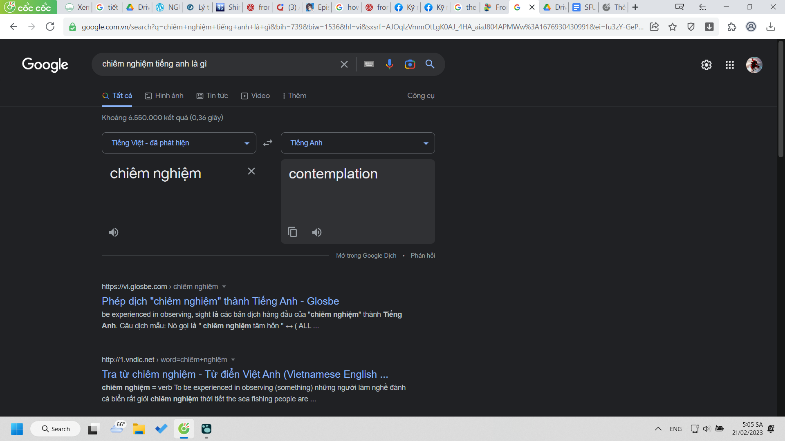
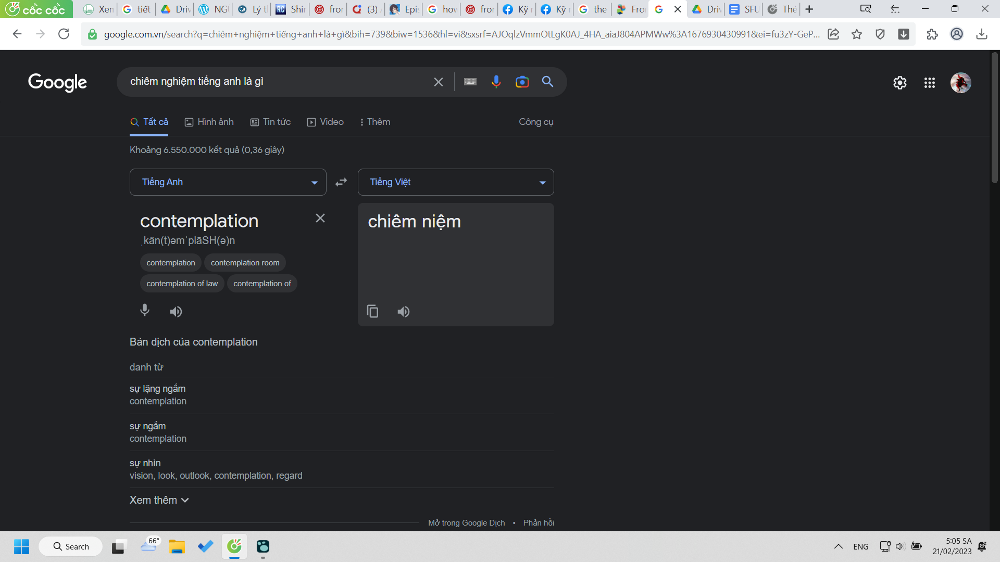

title:: ULISS/Sem2/Skills For University Success

- [[ULISS/Sem2/Skills For University Success/Course Book]]
meta:: [[ULISS]]

- ##### Có một cách để đổi từ nghe cho nó bớt đa cấp đi đó chính là tra từ điển, nhưng nếu không ra thì chuyển sang tiếng khác như tiếng Anh mà tìm :))) wao how come, cái này là thuộc về Việt ngữ.
  collapsed:: true
	- 
	- 
- ##### [SFUS _ Reflection #1](https://docs.google.com/document/d/1UFHbuTayLcL6PLOnDc5a5uaxiykwAyKfxk2mFHsxRg8/edit)
  ---
- ## Course Information
  collapsed:: true
	- Rules
	- Test
- ## Note
	- Muốn thành công thì phải **biết**
		- sao cô không đi sâu ý này
	- Cô bảo không ai bày sẵn cho
		- bày được phương pháp + thông tin nhưng dễ quá nên người ta không tin, không có cảm giác, ý thức về sự thành công
		- viễn cảnh phim tưởng tượng
		  collapsed:: true
			- thời gian
				- chiều
			- không gian
				- ở tầng hai, phòng trên đầu phòng anh Lâm
				- xung quanh ốp gỗ như nhà cô Đào
			- tôi lục thùng tài liệu
			- đưa một tờ giấy cũ A4 in bài viết
				- trông như tài liệu từ hồi cấp 3
				- ừ xong rồi xem xong cất như nào???
				- mày chưa tính đến và phim cũng không show nhưng thực tế sẽ khá rắc rối đấy, hay đốt đi như anime như kiểu đã lĩnh hội được :)))
			- chẳng hạn đưa cho con mình
			- nó hỏi: "cái gì đây?"
			- tôi nói: "đọc đi"
			- nó đọc
			- "đọc xong rồi, bài này có gì hay thế" (dưới góc độ văn chương)
			- "không chẳng có gì hay đâu"
			- "vậy thế đưa làm gì"
			- tôi cười
			- ẩn ý là nội dung của bài viết như thể bài của trẻ con
				- hạnh phúc nhỏ nhoi, chẳng hạn sống thêm một giây cũng đã là thành công
	- (:rất thư giãn - tức là đoạn đấy trong record, sẽ xuất file thành video xong chèn ảnh sau)
		- Thành công dễ đến vậy sao
	- Giá như mọi dự án xuyên suốt
		- thế cách dễ dàng khả thi nhất là có một ekip đồng hành suốt 4 năm
	- Hóa ra môn này dạy toàn kĩ năng mềm, oke phết (lưu chú - từ này anh Long cũng dùng)
		- Để xem có làm tốt như những gì tôi được học ở MỞ không?
			- ghi cái này để làm gì? để sau nhớ mà so sánh
		- Hoặc so sánh với Human-AI learning của mình (mục đích lưu chú)
	-
- ## Lessons