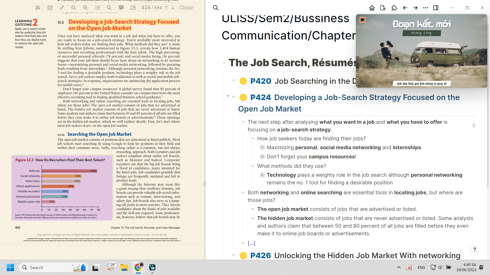
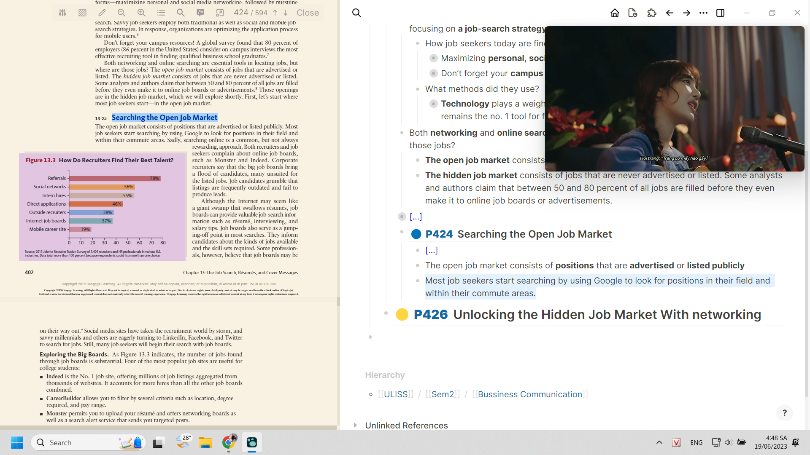

- # **The Job Search, Résumés, and Cover Messages**
	- ## ((648f542e-b461-4b9a-86d3-76e50323006a))
	- ## ((648f5442-8df9-4d60-aba4-e52e983090fa))
		- The next step after analysing **what you want in a job** and **what you have to offer** is focusing on **a job-search strategy**.
		  id:: 648f5a63-2790-4db1-bc52-03bbdd8f2957
			- How job seekers today are finding their jobs?
				- Maximizing **personal**, **social media networking** and **internships**
				  collapsed:: true
					- A study by staffing firm Jobvite, reveals how 1,404 human resources and recruiting professionals find the best talent
					  collapsed:: true
					  ((648f7440-80b2-46ed-ae1f-6fdd2851cf61))
						- {{cloze ồ màu cũng là cái hay để highlight và nên phân loại theo số màu có, theo ý nghĩa màu gợi nên}}
					- The high percentage of successful personal referrals (78 percent) and social media hiring (56 percent) suggests
				- Don’t forget your **campus resources**!
				  collapsed:: true
					- A global survey found that 80 percent of employers (86 percent in the United States) consider on-campus interviews the most effective recruiting tool in finding qualified business school graduates
			- What methods did they use?
				- **Technology** plays a weighty role in the job search although **personal networking** remains the no. 1 tool for finding a desirable position
				  collapsed:: true
					- => Savvy job seekers employ both traditional as well as social and mobile jobsearch strategies. In response, organizations are optimizing the application process for mobile users.
		- Both **networking** and **online searching** are essential tools in **locating jobs**, but where are those jobs?
			- **The open job market** consists of jobs that are advertised or listed.
			- **The hidden job market** consists of jobs that are never advertised or listed. Some analysts and authors claim that between 50 and 80 percent of all jobs are filled before they even make it to online job boards or advertisements.
		- {{cloze phần này mình làm tốt phết trong việc sắp xếp data, lúc đầu theo thứ tự đọc của bài thì oke nhưng trình bày vào thì không ổn, đọc rối hơn, dù có sự liên kết cũng không thấy sự phân tầng. Ý đầu ý cuối để dẫn nhưng cũng quan trọng vì dù là dẫn thì nó cũng là ý, còn phần nội dung đan xen vào, để nổi bật ra cũng được nhưng thế không có sự phân biệt với phần dẫn, và như thường lệ, nó thuộc cái nào, chợt đọc kĩ và tư duy, thì ừ nó là job search stratergy mà, xong phần câu hỏi để tách ra hai câu rồi 3 cái gạch đầu dòng thì thiếu liên kết quá, song xét kĩ ra thì đây là những ý đáp án của câu hỏi kia mà chứ có phải họ nói một đằng đưa đáp án một nẻo đâu dù có hai câu hỏi mà họ dẫn, họ viết nó không sát đúng vào câu hỏi, xong nhìn kĩ nữa ta nhận ra có thể ghép chia gộp được, thế là các ý đã vào bên trong các câu hỏi, mình cũng thêm dấu => cho cái ý thứ 3 vì phần ý con nó không phải sự giải thích mà là sự suy ra, là cách ứng dụng. Lúc đầu mình còn định để ví dụ lên trên, các ý suy ra xuống dưới như diễn dịch cơ vì thấy nhiều ý lúc này có thể cho vào làm phần con của một ví dụ, vì người ta chứng minh kiểu đó, là diễn giải ví dụ, song ta nhận ra ngu, vì dù gì họ cũng định khái quát hóa, và làm thế hóa ra cái ta cần là dẫn chứng chứ không phải ý tưởng, tiền đề hoặc luận điểm à}}
		  collapsed:: true
			- và khi mở một phần xem ta cũng chỉ cần để mức này (nếu lấy P424 là một phần lớn thì ta nhìn đến bullet con thứ 3 là cùng) để nhìn là đủ hiểu, vừa nắm được có bao nhiêu ý trong một phần, sự liên kết và một số luận điểm
			- 
		- ### ((648f7a46-d0a0-4a99-be3b-035a3353b190))
			- {{cloze làm bullet lớn màu vàng chung chung, bullet dưới là xanh, các hình là tím, vì tính ra cũng dễ nhìn với màu tím dìu dịu, đỏ sẽ là chú ý cực quan trọng, xanh lá cây thì chưa biết, chưa nghĩ ra hoặc chưa tra mạng để nó suggest tất cả các khả thể của dạng thông tin được noted}}
			- The open job market consists of **positions** that are **advertised** or **listed publicly**
			- **Online searching**
			  collapsed:: true
				- {{cloze cũng phải check xem có tối giản được từ nào, nhưng đừng cố tối giản quá để không mất ý nhưng mất khả năng liên kết hiểu hoặc mất ý ngầm, vì mấy khi ta đọc pdf, ta đọc note thôi, như iwr đây không bỏ start searching vì nó có thể gợi việc họ bắt đầu bằng cái gì}}
				  collapsed:: true
					- 
				- **Most job seekers** start searching by **using Google** to look for positions in **their field** and **within their commute areas**.
				- Sadly, **searching online** is a **common**, **but not** always **rewarding**, **approach**.
					- Both recruiters and job seekers complain about online job boards, such as Monster and Indeed.
					- Corporate recruiters say that the big job boards bring a flood of candidates, many unsuited for the listed jobs.
					- Job candidates grumble that listings are frequently outdated and fail to produce leads.
			- **Job boards**
			  collapsed:: true
				- can **provide** valuable job-search information such as **résumé**, **interviewing**, and **salary tips** although the Internet may seem like a giant swamp that swallows résumés
				- **serve as** a **jumping-off point** in most searches.
					- They inform candidates about the kinds of jobs available and the skill sets required.
				- Some professionals, however, believe that job boards may be on their way out
				  collapsed:: true
					- Social media sites have taken the recruitment world by storm, and savvy millennials and others are eagerly turning to LinkedIn, Facebook, and Twitter to search for jobs.
				- Still, many job seekers will begin their search with job boards.
			- #### ((648f92d0-f0a5-439c-a750-187b49f2e0ef))
				- the number of jobs found through job boards is substantial
				- Four of the most popular job sites are useful for college students
					- **Indeed** is the No. 1 job site, offering millions of job listings aggregated from
					  thousands of websites. It accounts for more hires than all the other job boards
					  combined.
					- **CareerBuilder** allows you to filter by several criteria such as location, degree
					  required, and pay range.
					- **Monster** permits you to upload your résumé and offers networking boards as
					  well as a search alert service that sends you targeted posts.
					- **CollegeGrad** describes itself as the “number one entry-level job site” for stu-
					  dents and graduates. Applicants can search for entry-level jobs, internships,
					  summer jobs, and jobs requiring one or more years of work experience.
			- #### ((648f92e9-e717-4f0b-a535-3965b85267ae))
				- The **best way** to find a **job online** is at a **company’s own website.** (probably)
					- Many companies post job openings only at their own sites to avoid being inundated by the hordes of applicants - many unqualified - responding to postings at online job boards.
					- A company’s website is the first place to go if you have a specific employer in mind.
					- You might find vision and mission statements, a history of the organization, and names of key hiring managers.
				- Possibly you will see a listing for a position that doesn’t fit your qualifications.
					- Even though you’re not right for this job, you have discovered that the company is hiring.
					- Don’t be afraid to send a résumé and cover message expressing your desire to be considered for future jobs.
				- Rather than seeking individual company sites, you might prefer to visit aggregator LinkUp.
					- It shows constantly updated job listings from small, midsized, and large companies.
			- #### ((648f92f0-1445-46f3-82bd-e86692910f3b))
				- If you seek a job in a specialized field, look for a niche site
					- **Dice** for technology jobs
					- **Advance Healthcare Network** for jobs in the medical field
					- **Accountemps** for temporary accounting positions
				- Niche websites also exist for job seekers with special backgrounds or needs,
					- **GettingHired** for disabled workers
					- **Workforce50** for older workers
				- If you are looking for a short-term job
					- **CoolWorks** specializes in seasonal employment.
				- If you yearn for a government job
					- **USA Student Jobs** is a website for students and recent graduates interested in federal service.
			- #### ((648f92f3-b697-460b-a7d2-1a71b5a951ed))
				- Job seekers are eagerly embracing smartphone apps to gain an edge in the job search. With many of the following mobile apps, you can access and vet job openings as soon as they are listed—even when you are on the go.10 Like its full website, the Indeed Job Search app lets you filter your search results based on your field, desired salary, and location. The app Hidden Jobs lists nearly 2 million unpublicized positions by tracking company job announcements so you don’t have to. Intro is an app that connects you to people in your field or in your social media network. JobAware allows you to integrate all your Internet job-search activities including LinkedIn. JobCompass helps you narrow the search to your zip code. LinkedUp Job Search Engine, Monster, Reach, Simply Hired, Snagajob, and Switch all offer mobile links to job listings from a variety of sources.
			- #### ((6494547a-6c0d-48f8-96f8-18c4d80d1bfb))
				- Despite the rush to
				  mobile technology, some organizations still list openings in newspapers. Don’t
				  overlook this possibility, especially for local jobs. Plenty of jobs can also be found
				  through career fairs and university and college alumni contacts.
				- When posting job-search information online, it’s natural to want to put your
				  best foot forward and openly share information that will get you a job. The chal-
				  lenge is to strike a balance between supplying enough information and protect-
				  ing yourself. To avoid some of the risks involved, see the cautions described in
				  Figure 13.4.
				-
	- ## ((648f5337-d8dc-4956-954c-bea22f1e5d22))
		- Not all available positions are announced or advertised in the open job market
			- Between 50 and 80 percent of jobs are estimated to be in the hidden job market
			- 11 Companies prefer to avoid publicizing job announcements for a number of reasons. They don’t welcome the deluge of unqualified candidates
		- Companies dislike hiring unknown quantities.
			- Career coach Donald Asher, author of Cracking the Hidden Job Market, sets this scene
				- Imagine you are a hiring manager facing hundreds of résumés on your desk and a coworker walks in with the résumé of someone she vouches for.
			- Which résumé do you think hits the top ofthe stack?
			- Companies prefer known quantities.
			- The most successful job candidates seek to transform themselves from unknown into known quantities through networking.
			- More jobs today are found through referrals and person-to-person contacts than through any other method. That’s because people trust what they know.
			- Therefore, your goal is to become known to a large network of people, and this means going beyond close friends.
		- #### ((6494612c-d448-4141-83c6-af8c22505014))
			- Because most candidates find jobs today through networking, be prepared to work diligently to build your personal networks. This effort involves meeting people and talking to them about your field or industry so that you can gain information and
			- locate job vacancies. Not only are many jobs never advertised, but some positions
			  aren’t even contemplated until the right person appears. One recent college gradu-
			  ate underwent three interviews for a position, but the company hired someone else.
			  After being turned down, the grad explained why he thought he was perfect for this
			  company but perhaps in a different role. Apparently, the hiring manager agreed and
			  decided to create a new job (in social media) because of the skills, personality, and
			  perseverance of this determined young grad. Traditional networking pays off, but
			  it requires dedication. Here are three steps that will help you establish your own
			  network:
			  Step 1. Develop a contacts list. Make a list of anyone who would be willing to
			  talk with you about finding a job. Figure 13.5 suggests possibilities. Even if you
			  haven’t talked with people in years, reach out to them in person or online. Consider
			  asking your campus career center for alumni willing to talk with students. Also dig
			  into your social networking circles, which we will discuss shortly.
			  Step 2. Make contacts in person and online. Call the people on your list or con-
			  nect online. To set up a meeting in person, say, Hi, . I’m looking for a
			  job and I wonder if you could help me out. When could I come over to talk about
			  it? During your visit be friendly, well organized, polite, and interested in what your
			  contact has to say. Provide a copy of your résumé, and try to keep the conversation
			  centered on your job search. Your goal is to get two or more referrals. In pinpointing
			  your request, ask, Do you know of anyone who might have an opening for a person
			  with my skills? If the person does not, ask, Do you know of anyone else who might
			  know of someone?
			  Step 3. Follow up on your referrals. Call or contact the people on your list.
			  You might say something like, Hello. I’m Stacy Rivera, a friend of Jason Tilden.
			  He suggested that I ask you for help. I’m looking for a position as a marketing
			  trainee, and he thought you might be willing to spare a few minutes and steer
			  me in the right direction. Don’t ask for a job. During your referral interview, ask
			  how the individual got started in this line of work, what he or she likes best (or
			  least) about the work, what career paths exist in the field, and what problems a
			  newcomer must overcome. Most important, ask how a person with your back-
			  ground and skills might get started in the field. Send an informal thank-you note
			  to anyone who helps you in your job search, and stay in touch with the most
			  promising people. Ask whether you could stay in contact every three weeks or so
			  during your job search.
			  Unfortunately, many new grads are reluctant to engage in traditional person-to-
			  person networking because it feels pushy and it definitely requires much effort. They
			  are much more comfortable with networking through social media sites.
		- #### ((64946155-bc30-4d25-825e-d6eb9a5d9f1f))
			- As digital technology continues to change our lives, job candidates have powerful
			  tools at their disposal: social media networks. Social media have become critical
			  in a job search. If you just send out your résumé blindly, not much will happen.
			  However, if you have a referral, your chances of landing an interview multiply. The
			  growth of social networks has opened up an additional path to developing those
			  coveted referrals.
			  networking on LinkedIn to Find a Job. If you are seriously looking for a job,
			  it’s extremely important that you list yourself on LinkedIn. This social media site
			  dominates the world of job searching and recruiting. In a poll of 1,855 recruiting
			  and staffing professionals, 95 percent said that they used LinkedIn as a recruiting
			  tool.13 It’s truly the place to find and be found, especially for new graduates. It lists
			  well over a million and a half student jobs and internships in addition to millions
			  of full-time jobs.14 Developing a credible presence on LinkedIn enables you to post
			  information about yourself in one central place where it’s available to potential
			  employers, graduate schools, future colleagues, and people you will want to stay
			  connected to. A LinkedIn page tells the working world that you are a professional,
			  and it remains significant even after you obtain a position.
			  One of the best ways to use LinkedIn is to search for a company in which you
			  are interested. Try to find company employees who are connected to other people
			  you know. Then use that contact as a referral when you apply. You can also send an
			  e-mail to everyone in your LinkedIn network asking for help or for people they could
			  put you in touch with. Don’t be afraid to ask an online contact for advice on getting
			  started in a career and for suggestions to help a newcomer break into that career.
			  Another excellent way to use a contact is to have that person look at your résumé
			  and help you tweak it. Like Facebook, LinkedIn has status updates, and it’s a good
			  idea to update yours regularly so that your connections know what is happening in
			  your career search and afterward.
			  LinkedIn can aid your job search in at least five ways, as shown in Figure 13.6.
			  Because LinkedIn functions in many ways as a résumé, you will find tips for
			  preparing your LinkedIn profile in the next pages.
			- Enlisting Other Social networks in a Job Hunt. In addition to LinkedIn, job
			  seekers can join Facebook, Twitter, and Google+ to find job opportunities, market
			  themselves to companies, showcase their skills, highlight their experience, and possi-
			  bly land that dream job. Because organizations may post open jobs to their Facebook
		- #### ((6494618f-a0d0-4f3f-a364-d9748787c4c0))
			- A large part of your job-search strategy involves building a brand for yourself. You
			  may be thinking, Who me? A brand? Yes, absolutely! Even college graduates should
			  seriously consider branding because finding a job in a competitive market is tough.
			  Before you get into the thick of the job hunt, focus on developing your brand so that
			  you know what you want to emphasize.
			  Personal branding involves deciding what makes you special and desirable in
			  the job market. What is your unique selling point? What special skill set makes
			  you stand out among all job applicants? What would your instructors or employers
			- say is your greatest strength? Think about your intended audience. What are you
			  promoting about yourself?
			  Experts suggest that you create a tagline that describes what you do, who you
			  are, and what’s special about you. A nurse wrote this fetching tagline:
			  Tireless, caring Registered Nurse who helps pediatric cancer patients and their
			  families feel at ease throughout treatment and recovery
			  If you prefer a shorter tagline for your business card, consider the sample tag-
			  lines for new grads in Figure 13.7. It’s OK to shed a little modesty and strut your
			  stuff. However, do keep your tagline simple, short, and truthful so that it’s easy to
			  remember.
			  Once you have a tagline, prepare a professional-looking business card with your
			  name and tagline. Include an easy-to-remember e-mail address such as firstname
			  .lastname@domain.com. Consider using CardDrop, an app that creates a digital
			  business card to connect with new contacts and help you be remembered.
			  Now that you have your tagline and business card, work on an elevator speech.
			  This is a pitch that you can give in 60 seconds or less describing who you are and
			  what you can offer. Tweak your speech for your audience, and practice until you
			  can say it naturally. Here are suggestions to help you prepare your own authentic
			  elevator speech depending on your situation:
			  Hi, my name is , and I am about to graduate from ____________
			  with a degree in . I’m looking to ____________ because I enjoy
			  . Recently I where I was able to develop skills
			  such as . I’m most confident about my skills in .
			  I’m inspired by the field (or position of) because .
			  Do you have any suggestions or advice on how I can ?
- ---
- Khi thuyết trình bài này sẽ có cái khó vl là... đưa mỗi ý chính lên, đưa thêm một câu dẫn background giúp mình và người ta grasp. Mình nhớ mạch còn người ta đọc liếc thôi cũng đủ hiểu chứ không chỉ thấy gợi ý nhan đề
- => mình có thể học thuộc ý dẫn của người ta vì nó cũng informative đủ đường: phương pháp, phản biện, lí giải, gợi ý kết hợp các yếu tố, hướng dẫn các bước và nhắc nhở những thứ nhỏ nhặt xung quanh,...
- nhưng thôi trình không đủ mà cũng không nên đem tất cả sách lên. ý chính nhất là được rồi. rồi mình dẫn bằng mấy câu nhạt nhẽo đột ngột như là so linked in is,... as you know, many people use,... nó cũng tương tự câu dẫn ở các phần trong sách nhưng đơn giản hơn cực nhiều.