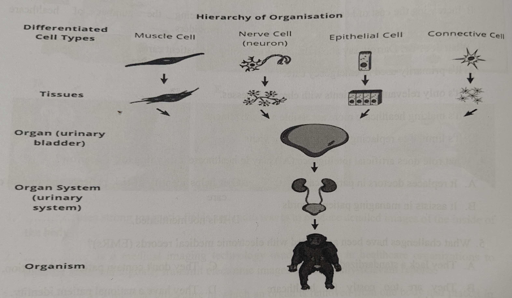

## UNIT 4: TREATMENT AND INTERVENTION
	- ### I. Match the following pictures with the correct medical term (A-F) and its definition (1-6)
	  collapsed:: true
		- ***DNA sequencing*** uses strong magnetic fields and radio waves to produce detailed images of the inside of the body
		- ***PACS*** is a medical imaging technology used primarily in healthcare organizations to securely store and digitally transmit electronic images and clinically-relevant reports.
		- ***Organ transplant*** is a medical procedure in which an organ is removed from one body and placed in the body of a recipient, to replace a damaged or missing organ.
		- ***Al diagnosis*** refers to the application of artificial intelligence and machine learning techniques in the field of medicine to aid in examining diseases and medical conditions.
		- ***Telemedicine*** refers to the provision of remote clinical services, via real-time two-way communication between the patient and the healthcare provider, using electronic audio and visual means.
		- ***Bio printing*** uses a digital file as a blueprint to fabricate biomedical parts that closely imitate the characteristics of natural tissue.
	- ### II. You are going to listen to Dr. Bruce Darrow, a specialist in cardiology talking about technological advances in medical field, then choose the correct answer to the following questions.
	  collapsed:: true
		- collapsed:: true
		  1. How does technology impact healthcare, according to Dr. Darrow?
			- A. It replaces doctors with robots
			- B. It empowers patients to take control of their health.
			- C. It only benefits patients in hospitals.
			- D. It eliminates the need for medical records.
		- collapsed:: true
		  2. In what ways is technology changing patient care?
			- A. Moving care from hospitals to patients' homes.
			- B. Increasing the cost of healthcare.
			- C. Limiting patient access to medical information
			- D. Reducing the number of healthcare providers.
		- collapsed:: true
		  3. What does Dr. Darrow say about the use of technology in patient care?
			- A. It's primarily used in emergency care.
			- B. It's only relevant for patients with chronic illnesses.
			- C. It's making healthcare more accessible and convenient.
			- D. It's limited to replacing in-person doctor visits.
		- collapsed:: true
		  4. What role does artificial intelligence (AI) play in healthcare, according to Dr. Darrow?
			- A. It replaces doctors in patient care.
			- B. It assists in managing patient records
			- C. It helps identify at-risk patients and improve care
			- D. It is not mentioned.
		- collapsed:: true
		  5. What challenges have been associated with electronic medical records (EMRs)?
			- A. They lack a standardized format
			- C. They don't contain patient information.
			- D. They have a national patient identity.
			- B. They are too costly for healthcare providers.
		- collapsed:: true
		  6. How does Dr. Darrow describe the progress in connecting EMRS?
			- A. Slow and ineffective.
			- B. Rapid and successful.
			- C. Non-existent.
			- D. Expensive but improving
		-
	- ### III
	  collapsed:: true
		- #### A. Read the following passage about organ transplantation, then use the words to fill in the blanks
			- A. screening
			- G. registration
			- C. cells
			- D. deceased
			- J. transplanted
			- F. fair
			- B. lungs
			- H. limbs
			- I waiting
			- N. tissues
			- O. organs
			- E. fatal
			- K. blood
			- L. medication
			- R. critical
			- M. saving
			- P. size
			- Q. living
		- A transplant is a process where an organ, tissue, group of cells or a whole limb is removed from on person (the donor) and surgically *transplanted* to someone else (the recipient). Even though they ar commonly called organ transplants, as you can see a transplant can occur on a number of levels withi the hierarchy of organization
		- 
		- A person might need a transplant if:
			- They have an organ that is not working any more (end-stage organ failure).
			- •They have suffered some damage to an organ and the transplant would improve their quality of life. For example, skin tissue transplants are performed when someone has suffered severe burns to their skin in areas such as the face.
			- It is important to note that tissue transplants can also occur within the same person, e.g. a surgeon might take skin from someone's upper thigh and use it to replace the damaged skin on their face and neck. This is called an autograft or auto transplantation and includes skin grafts, blood vessel grafts, bone and bone marrow grafts.
		- **What Organs Can Be Transplanted?**
			- *organs* - heart, kidney, liver, lung, pancreas, stomach and intestine .
			- *tissues* - cornea, bone, tendon, skin, pancreas islets, heart valves, nerves and veins
			- *cells* - bone marrow and stem cells
			- *limbs* - hands, arms and feet
			- As scientific understanding and technology improves, so do the advances in organ transplantation. For example, whole face transplants are now a possibility for some people.
			- Additionally, multi-organ transplants (although less common than single-organ transplants) are also now occurring. Common multi-organ transplants include the heart and *lungs* or and kidney pancreas
		- **The Transplant Process**
			- Organ transplantation can be a life-*saving* procedure for those who are experiencing organ failure. However, for some organs, the promise of a replacement organ means that someone else has died. Consequently, when a recipient begins the transplant process they are firstly assessed to determine whether they can be entered onto the organ transplant *waiting* list. However, receiving an organ is not as simple as waiting your turn in line.
			- This *registration* process is designed to ensure that the transplant process is as *fair* as possible and prioritizes people based on their medical need, their physical compatibility and geographic proximity to the donor organ.
			- **Organ Screening:** Organs that are donated undergo a screening process to ensure that the donor and organ are free from infection or disease.
			- **Blood Group and Tissue Compatibility:** Next, the organ donor and the recipient must be matched by *blood* group and/or tissue compatibility.
			- **Size of the Organ:** The organ must be a suitable *size* for the donor, e.g. a donor heart must fit comfortably inside the recipient's ribcage.
			- **Severity of the Condition:** If more than one person is a match, the person who requires the organ more due to their deteriorating condition will be prioritized.
			- **Recipient's Availability:** If the recipient does not answer the phone, has an infection, lives further away than the organ viability timeframe, then the donor organ will be given to someone else.
			- In summary, to be considered for the organ transplant waiting list, the recipient must have an irreversible and otherwise *fatal* disease resulting from organ failure, while still being healthy enough to survive and benefit from the organ transplant and must be willing to comply with a life-long *medication*and health regime.
			- Additionally, the way in which a donor dies also affects the transplant process. For most transplanted organs, the donor must die in a hospital setting under specific circumstances. This is because the donor organs need to be working well for the transplant to be possible and timing is *critical*. Once a donor organ becomes available, a suitable recipient is notified and the transplant surgery begins. Each organ has a viability timeframe - the heart and lungs are only viable for four to six hours after donor death, whilst an organ like the liver can remain viable for eight to 12 hours and the kidneys 24 to 36 hours after death.
		- **Who Can Become an Organ Donor?**
			- There are two types of organ donation:
				- *Living* Donors: A living donor is usually a relative or close friend of the person who needs the transplant. Organs that can be donated while the donor and recipient are alive include a kidney and part of the liver.
				- *Deceased* Donors: Dead after brain death (DBD) or death after circulatory death (DCD).
			- The decision to donate an organ can be very sensitive for families. At times, the family has to make the difficult decision to end life-support before the donor organs can become available.
	- #### B. In pairs, discuss the benefits and drawbacks of organ donation
- ## 3D BIO PRINTING
	- ### Watch a short clip about how a 3D bio printer operates, fill in ONLY ONE WORD for each gap
		- 1. Bioprinting is a branch of ... medicine.
		- 2. Instead of starting with metal or plastic, bioprinters use ... as a printable material
		- 3. The bulk of many bio inks are water-rich molecules called ...
		- 4. Some bio inks include a single type of cell, while others combine several different kinds to produce more complex ...
		- 5. Extrusion-based bioprinting involves pushing bio ink through a round nozzle attached to a print head, producing a continuous filament that is roughly the thickness of a human ...
		- 6. After printing, some bio inks may require UV light or an additional chemical or physical process to stabilize the ...
		- 7. Researchers are working on incorporating ... into bioprinted tissue to improve
		- 8. Bioprinting technology holds the potential to extend human life by printing and replacing ...
	- ### V. Read the following passage about 3D bioprinting proceduce, then answer the questions
		- #+BEGIN_CENTER
		  **What are the steps of the 3D Bioprinting Process**
		  #+END_CENTER
		- Bioprinting is a process that requires rigor and high control in all regards. Each step below is an area
		- **1. Pre-Bioprinting**
		  collapsed:: true
			- The pre-bioprinting process consists of various steps that must all be exactly right-margins for variance and error are minimal if the result is to be a useful tissue structure. The first step is to conceptualize and specify the desired structure. This will define the shape, size, and general physical properties of the tissue and the types of cells and support/nutrient materials that will be used. With the outline of the structure defined, specialist CAD tools are used to create a highly detailed 3D model of the structure. An appropriate bio-ink is then selected or created, containing the structural, hardening. and nutrient mix appropriate for the tissues to be grown. Cell selection and cultivation in vitro is the most delicate step, involving incubating and encouraging the reproduction of cells in a culture medium under tightly controlled conditions, to ensure their viability and sufficiency.
		- **2. Bioprinting**
		  collapsed:: true
			- Bioprinting is the final realization step that takes the foundational work and builds the required tissue sample. It is ready for incubation and the planned uses for drug evaluation, toxicity testing, or patient implant. The tissue sample is constructed either by stereolithographic methods or by the self- organization designed into the plan.
		- **3. Post-Bioprinting**
		  collapsed:: true
			- After bioprinting, there are various critical processing steps that ensure the function and viability of the built tissue. First, the printed matrix material must be cross-linked to create a robust and stable structure. Various methods are available, typically UV cure, heat treatment, and externally applied chemical agents. Maturation/incubation then allows the cells to divide and differentiate. Tightly controlled environmental conditions are required for this to proceed. During maturation, and again once matured, the viability of the cells is assessed to ensure they are performing their intended functions. After maturation, the built tissue is characterized to determine its physical, biological, and biochemical character. This process uses techniques such as immunohistochemistry to assess the tissue behavior. Finally, the bioprinted tissue will be tested to ensure it is functioning as expected. A wide range of possible tests are available, suited to particular tissue types.
		- **Bio printing techniques**
		  collapsed:: true
			- To date, no single bioprinting technique enables the production of all scales and complexities of synthetic tissues. The three major bioprinting techniques of inkjet, laser-assisted, and extrusion bioprinting each have specific strengths, weaknesses, and limitations.
		- **Inkjet printing**
		  collapsed:: true
			- Inkjet bioprinting was the first bioprinting technology and is very similar to conventional 2D inkjet printing. A hydrogel pre-polymer solution with encapsulated cells (called a bioink) is stored in the ink cartridge. The cartridge is then connected to a printer head and acts as the bioink source during the electronically controlled printing process. During printing, the printer heads are deformed by a thermal or piezoelectric actuator and squeezed to generate droplets of a controllable size. The advantages of inkjet printing include: (1) low cost due to similar structure with commercial printers, (2) high printing speed conferred by the ability of the printer heads to support parallel work mode, and (3) relatively high cell viability
			- However, because current printer heads are based on microelectromechanical system (MEMS) devices, there is a relatively small deformation generated by either thermal or piezoelectric actuation at the nozzle opening. As a result, MEMS-based printer heads cannot squeeze out high viscosity materials (N15 mPa/s) and do not work well with bioinks with high cell density (N1 x 106 cells/mL). High cell density increases the average viscosity of bioinks, resulting in clogging of the head. When bioinks are initially loaded into the ink cartridge, they are well mixed. Over the entire printing process, however, cells begin to settle in the cartridge, increasing the viscosity of the bioink and often clogging the printer head.
		- **Laser-assisted printing**
		  collapsed:: true
			- Laser-assisted printing originated from laser direct-write and laser-induced transfer technologies. The critical part of the laser-assisted printing system is a donor layer that responds to laser stimulation. The donor layer comprises a 'ribbon' structure containing an energy-absorbing layer (e.g., titanium or gold) on the top and a layer of bioink solution suspended on the bottom. During printing, a focused laser pulse is applied to stimulate a small area of the absorbing layer. This laser pulse vaporizes a portion of the donor layer, creating a high pressure bubble at the interface of the bioink layer and propelling the suspended bioink. The falling bioink droplet is collected on the receiving substrate and subsequently crosslinked. Compared to inkjet printing, laser-assisted printing can avoid direct contact between the dispenser and the bioinks. This noncontact printing method does not cause mechanical stress to the cells, which results in high cell viability (usually higher than 95% ). In addition, laser-assisted printing can also print highly viscous materials, and more types of bioinks can be used than in inkjet printing These features of laser bioprinting are promising, but the side effects of laser exposure on the cell are not yet fully understood. Moreover, laser diodes with high-resolution and intensity are expensive compared to other nozzlebased printing methods, and control of the laser printing system is complex, limiting the technique's adoption. Due to the high cost, there are few laser-assisted bioprinters, which are usually cumbersome and complex compared to other types of printers. A laser printing prototype was developed by combining optical laser sources with a lens. A more compact, high-throughput laser printing system was also built and this system was further developed into a highly accurate version with 10 um resolution. In addition to the high equipment cost, laser-assisted printing is still immature because of unexplored parameters affecting the droplet size and quality. Instead of building prototypes of laser-assisted bioprinters, more researchers have focused on investigating the relationships between laser parameters, such asintensity, and pulse time, with the quality of printed patterns,
		- **Extrusion printing**
		  collapsed:: true
			- Extrusion printing is a modification of inkjet printing. In order to print the viscous materials inkjet printers cannot deposit, extrusion printing uses either an air-force pump or a mechanical screw plunger to dispense bioinks. By applying a continuous force, extrusion printing can print uninterrupted cylindrical lines rather than a single bioink droplet. Almost all types of hydrogel pre-polymer solutions of varying viscosity as well as aggregates with high cell density can be printed with extrusion bioprinters.
			- While extrusion bioprinters can print a wider range of materials, they also expose the encapsulated cells to larger mechanical stresses that are thought to reduce cell viability. Most existing commercial bioprinters, including the Bioplotter and NovoGen 3D Bioprinting platform, are based on extrusion technology.
			- Extrusion bioprinting provides good compatibility with photo, chemical and thermal crosslinkable hydrogels of very different viscosities at a reasonable cost. A typical extrusion printer, the multi-head tissue/organ building system from the Cho group, includes three-axis motion control with six dispensing heads, supporting up to six different bioinks. The substrate plate contains heating and cooling functions to control thermally sensitive hydrogels. Dispensers in extrusion systems have a few differences. Pneumatic micro nozzles powered by compressed gases support a wider range of viscosity, but have difficulty precisely controlling the deposited mass. Screw-based nozzles can print without inlet air and are much cheaper, but they experience problems in high viscosity dispensing.
		- **Stereo lithography printing**
		  collapsed:: true
			- Stereo lithography has also been modified for bioprinting purposes. Like laser-assisted printing, stereo lithography bioprinters use light to selectively solidify a bioink in a layer-by-layer process that additively builds up objects. These printers use a digital light projector to cure bioinks plane-by-planc and have several advantages over traditional bioprinting methods. No matter how complex pattern in one layer is, the printing time is the same because the entire pattern is projected over the printing plane. As a result, the printer only needs a moveable stage in a vertical direction, which significantly simplifies the control of the printer. This reported stereolithography bioprinting system can achieve 100 µm resolution and printing times less than 1 h while maintaining very high cell viability (N90%)- The figure shows the woodpile and hexagonal structures printed by the stereolithography system. The fluorescent images of the hexagonal structures are encapsulated with human umbilical vein endothelial cells. This system was able to print hydrogel patterns with 50 μm resolution.
		- **The design of a 3Dprinter**
		  collapsed:: true
			- The design of the 3D home printer is nevertheless refreshingly simple. Its components are relatively few, and could theoretically be assembled by anyone with a rudimentary knowledge of mechanics and technological know-how. The 3 main elements of the printer are a metal framework which contains the mechanical part of the printer, a printer control board and a PC. The PC is connected via USB to the printer control board, which in turn is connected to the framework of the printer and attached to the side of the latter. A plastic filament of around 3mm in diameter feeds into the printer from an external source, connecting to the extruder motor inside the printer. During printing, the controlled movement of the extruder motor ensures the correct volume of plastic is used. The extruder motor in turn is connected to a heated extruder or 'hot end' that heats the plastic filament during printing. As the heated plastic emerges or is 'extruded to use the correct terminology, it cools and is arranged in layers to create a solid 3D model.
			- In order to move the extruder about in 3D space, there are 3 axes, each controlled by motors. The X. axis motor, located in a midway position on the metal framework of the printer, moves the extruder left and right, using a pulley. The two Z-axis motors, which are located on either side of the heated printing bed, move the entire X-axis up and down via two threaded rods. The heated bed of the printer, which lies directly underneath the hot end of the extruder, is moved back and forth beneath the extruder by the Y-axis motor located underneath the heated bed. The bed is heated to around 70 degrees Celsius to ensure the newly laid plastic does not warp as it cools. Overall control of the printer is effected by the printer control board and the PC which contains the programme of the model that is being printed
			- Once assembled, in theory it should be possible to print a 3D version of virtually anything. However, comparatively easy as it is to assemble, would-be DIY gadget enthusiasts should be warned that the printer has major technical limitations. The finished product will always have banding and surface detail remaining as evidence of how the model was laid down. In addition, operators of the printer have to be extremely careful not to knock it whilst the machine is in the process of printing, since this will end up in model distortion. Extreme care also has to be taken in the choice of plastic filament which will ultimately create the structure of the model. Some types of plastic may warp if the temperature is not controlled properly when the melted plastic leaves the nozzle, and later, when it is cooling on the bed. Obviously the 3D model will be the same colour as the plastic filament forming it, but colour limitations can easily be overcome by painting afterwards for a multicolour finish. Another problem is that the plastic structures have to be supported as they are laid down on the heated bed or they will distort or fall away as the plastic cools.
			- It is certain, however, that such issues will be overcome in the future. The innumerable advantages of 3D printers far outweigh any disadvantages and justify time and resources spent on such technology. Firstly, the product can be produced on the spot within a short time frame, thereby reducing time and cost of manufacturing by traditional means. Secondly, printing objects on a 3D printer removes the need for storage space of items since whatever is required is printed as and when necessary. Finally, despite expensive set-up costs, in the long run, 3D printing works out far cheaper than normal manufacturing processes since there is no longer a need for labour costs
		- Questions 1-8. Choose the correct answer to the following questions
		  collapsed:: true
			- collapsed:: true
			  1. What is the primary purpose of 3D bioprinting?
				- A. Creating sculptures
				- B. Generating edible food
				- C. Constructing three-dimensional tissue structures
				- D. Designing clothing
			- collapsed:: true
			  2. Which step of the bioprinting process involves creating a detailed 3D digital model of the tissue structure?
				- A. Bioprinting
				- B. Cross-Linking
				- C. Pre-Bioprinting
				- D. Post-Bioprinting
			- collapsed:: true
			  3. Which bioprinting technique uses laser pulses to propel bio-ink droplets?
				- A. Inkjet Printing
				- B. Extrusion Printing
				- C. Stereolithography Printing
				- D. Laser-Assisted Printing
			- collapsed:: true
			  4. What is the main advantage of extrusion bioprinting?
				- A. Non-contact printing
				- B. High cell viability
				- C. Rapid printing speed
				- D. Low cost
			- collapsed:: true
			  5. During the maturation phase of bioprinting, what happens to the cells?
				- A. They are harvested for future use.
				- B. They undergo differentiation and division.
				- C. They are cross-linked with UV light.
				- D. They are characterized using immunohistochemistry.
			- collapsed:: true
			  6. Which step involves assessing the physical, biological, and biochemical characteristics of the tissue?
				- A. Cross-Linking
				- B. Maturation/Incubation
				- C. Characterization
				- D. Viability Assessment
			- collapsed:: true
			  7. What is the primary challenge in bioprinting complex organs?
				- A. Laser-Assisted Printing
				- B. Creating detailed 3D models
				- C. Supplying oxygen and nutrients to cells
				- D. Ensuring rapid printing speed
			- collapsed:: true
			  8. Which bioprinting technique utilizes a digital light projector to cure bio-ink layer by layer?
				- A. Selecting the right bio-ink
				- B. Extrusion Printing
				- C. Inkjet Printing
				- D. Stereolithography Printing
			- Questions 9-13, label the diagram below. Choose FIVE answers from the box and write the correct letter, A-G.
			- Questions 1-8. Choose the correct answer to the following questions