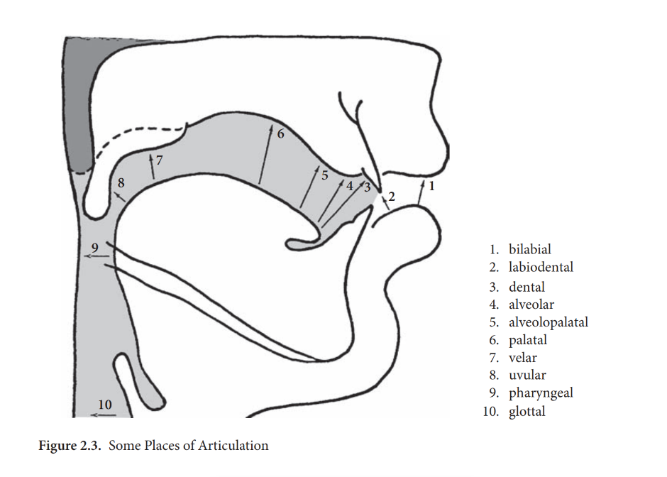

# Chapter 2: Consonants and vowels
	- ## 3. Consonant sounds
		- Speech is a phonetic continuum, a continuous, smoothly flowing set of movements
			- not a set of discrete and isolated movements.
		- It is convenient, however, to segment the speech chain into syllables, and to divide these in turn into consonants and vowels.
		- A syllable consists necessarily of a vowel; optionally, it may begin and/or end with a consonant.
		- A vowel is the nucleus or acoustic high point of a syllable; it is articulated for a longer time than 
		  surrounding consonants.
		- While vowels tend to continue the airstream, consonants tend to break it.
		- We begin our study of speech sounds with consonants, since they are somewhat easier to describe.
			- We will look first – in abstract – at how consonants are articulated before examining in detail the specific consonants of English.
		- ### 3.1 Classification of consonants
		  collapsed:: true
			- A consonant is defined as a speech sound which is articulated with some kind of stricture, 
			  or closure, of the air stream.
			- Consonants are classified according to four features
			  collapsed:: true
				- the state of the glottis
				  logseq.order-list-type:: number
					- in vibration (voiced)
					- open (voiceless);
				- the state of the velum
				  logseq.order-list-type:: number
					- lowered (nasal)
					- raised (oral);
				- the place of articulation
				  logseq.order-list-type:: number
					- the location where the stricture or place of maximum interference occurs
					- what articulators are involved
				- the manner of articulation
				  logseq.order-list-type:: number
					- the amount of stricture
						- whether it is complete
						- partial - “close approximation”
						- or relatively open - “open approximation”
						- The term “approximation” refers to the two articulators approaching (or approximating) one another.
			- In describing the place of articulation for consonants, it is traditional to list the active 
			  and then the passive articulator.
				- Consonants involve a rather large number of discrete places of articulation (see Figure 2.3)
					- bilabial
					  logseq.order-list-type:: number
					  collapsed:: true
						- the lips are brought together (the lower lip is active); the tongue is not involved 
						  but remains in the “rest position” (its position when you say ah for the doctor) – e.g. 
						  the sound of “b” in English;
					- labiodental
					  logseq.order-list-type:: number
					  collapsed:: true
						- the lower lip is brought up against the upper front teeth; again the tongue 
						  is in rest position – e.g. the sound of “f ” in English;
					- dental
					  logseq.order-list-type:: number
					  collapsed:: true
						- the tip of the tongue (or apex) protrudes between the teeth or touches the back 
						  of the upper teeth – e.g. the sound of “t” in Spanish or “th” in English;
					- alveolar
					  logseq.order-list-type:: number
					  collapsed:: true
						- the tip of the tongue makes contact with or is in close approximation to the 
						  alveolar ridge – e.g. the sound of “d” in English;
					- alveolopalatal
					  logseq.order-list-type:: number
					  collapsed:: true
						- the front, or blade, of the tongue is raised to an area between the 
						  alveolar ridge and the palate – e.g. the sound of “sh” in English;
					- palatal
					  logseq.order-list-type:: number
					  collapsed:: true
						- the front of the tongue is brought up against the palate – e.g. the sound of “y” 
						  in English;
					- velar
					  logseq.order-list-type:: number
					  collapsed:: true
						- the back, or dorsum, of the tongue is brought into contact with the velum – e.g. 
						  the sound of “g” in English;
					- uvula
					  logseq.order-list-type:: number
					  collapsed:: true
						- the back of the tongue touches the uvula;
					- pharyngeal
					  logseq.order-list-type:: number
					  collapsed:: true
						- the root of the tongue (specifically, the epiglottis) is moved backwards 
						  against the wall of the pharynx; and
					- glottal
					  logseq.order-list-type:: number
					  collapsed:: true
						- the vocal cords, functioning as articulators, make a brief closure.
				- 
				- While the uvular and pharyngeal places are not used for the articulation of English 
				  consonants, they are used in other languages
					- e.g.
						- the uvular for German “r”
						- a French fricative
						- the pharyngeal for a fricative in Arabic
					- Two places of articulation may also be used at the same time – what is called “coarticulation” – as in the case of labiovelars, which involve the lips, on one hand, and the tongue and velum, on the other.
			- Each of the various places of articulation just examined may combine with a number 
			  of different manners of articulation to produce consonant sounds:
				- **stop**: (“oral stop”) involving complete closure of two articulators with the velum raised 
				  logseq.order-list-type:: number
				  (velic closure) – e.g. the sound of “p” in English;
				- **nasal**: (“nasal stop”) involving complete closure of two articulators with the velum 
				  logseq.order-list-type:: number
				  lowered (“velic opening”) – e.g. the sound of “n” in English; for every stop position in 
				  English, there is a nasal articulated in the same position (homorganic);
				- **fricative**: (or “spirant”) involving close approximation of two articulators; the air 
				  logseq.order-list-type:: number
				  stream is partially obstructed so that a turbulent airflow is produced, resulting in a 
				  hissing or rubbing sound – e.g. the sound of “s” in English;
				- **affricate**: consisting of a stop released into a homorganic fricative – e.g. the sound of 
				  logseq.order-list-type:: number
				  “ch” in English; this sound is analyzed either as a complex or a simple sound;
				- **trill**: (or “roll”) involving complete closure alternating intermittently with open 
				  logseq.order-list-type:: number
				  approximation, that is, a rapid vibration of the active articulator against the passive 
				  articulator (this sound in not common in English except for the Scottish “r” made 
				  with an apical trill);
				- **flap**: (or “tap”) involving momentary complete closure in which the active articulator 
				  logseq.order-list-type:: number
				  strikes the passive articulator only once; it is one strike of a trill and similar to a stop 
				  except that the tongue is more tense and controlled than in a stop
				- **approximant**: one articulator approaches another but generally not to the extent that 
				  logseq.order-list-type:: number
				  a turbulent air stream is produced; there is usually open approximation in the three 
				  different types of approximants:
					- **lateral**: involving complete closure of the central portion of the vocal tract, with 
					  logseq.order-list-type:: number
					  the lateral passage of air; the air may pass around the sides with no stricture (open 
					  approximation) – e.g. the sound of “l” in English – or, in languages other than 
					  English, with some stricture (close approximation);
					- **retroflex**: involving the underside of the tongue curling back behind the alveolar 
					  logseq.order-list-type:: number
					  ridge towards the palate – e.g. the sound of “r” in English; laterals and retroflexes 
					  are called “liquids”;
					- **glide** (or semivowel): involving a glide to or from a vowel; this sound is articulated like a vowel (with no stricture) but functions as a consonant to begin or 
					  logseq.order-list-type:: number
					  end syllables – e.g. the sound of “w” in English.
		- ### 3.2 Consonants of English and their phonetic notation
			- We will now consider what combinations of voicing, place of articulation, and manner of 
			  articulation are utilized in the articulation of consonants in English.
				- Remember that not all possible combinations are used in all languages
					- though certain combinations (such as, perhaps, a velar trill) might be physiologically impossible.
				- As you read the following section, you should consult the consonant chart in Table 2.1.
			- On the consonant chart, following common practice
				- the places of articulation are listed across the horizontal axis (roughly corresponding to a cross-section of the mouth viewed from the left, with the front of the mouth on the left and the back of the mouth on the right)
				- the manners of articulation are listed along the vertical axis, moving in a rough way from greatest stricture at the top to lesser amounts of stricture as one moves down.
				- Voiceless consonant are listed above voiced ones, where applicable.
				- It is not necessary to specify the state of the velum since all consonants are oral except the nasals
			- Note that in giving a technical description of a consonant sound, it is traditional to list voicing, then place, then manner; get into the habit of describing the consonants in this order from the very beginning.
			- HINT: In learning the sounds of English and, especially, in transcribing English words, you 
			  must not allow yourself to be influenced by the written form.
				- Because of the imperfect correspondence between sound and spelling in English mentioned above, the spelling will often lead you astray or confuse you. You must try to function entirely in an oral 
				  context. You must also try to say words with a natural and relaxed pronunciation. There 
				  is a strong tendency when reading words or saying them in isolation to give them an 
				  overly formal and even distorted pronunciation. Try to speak as you do naturally in casual 
				  conversation. Do not whisper the words, either, as you cannot distinguish between 
				  voiced and voiceless sounds when whispering.
				  This section, in addition to surveying the consonant inventory of English, will teach 
				  you the phonetic alphabet symbol used to transcribe each of the consonants. We will use 
				  the modified version of the IPA used in North America. For the most part, you will be 
				  asked to give what is called broad transcription rather than narrow transcription. As the 
				  names imply, broad transcription merely records the grosser features of sound, whereas 
				  narrow transcription records all the nuances and finer aspects of sound, though not performance factors such as drunken slurs, loudness, and so on. The convention is to enclose 
				  broad transcription between slashes, such as /kæt/ for cat, and to use square brackets for 
				  narrow transcription, such as [khætÐ].