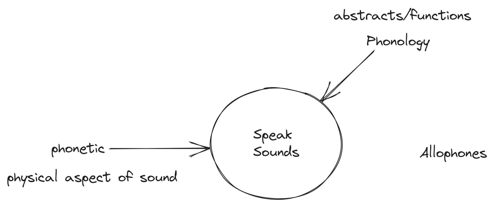

date:: [[Mar 14th, 2024]]

- 16:33 cái lúc thầy ờ là để tìm ví dụ, mình tự hỏi nếu dạy không căng, mà học sinh được nghĩ song song nói hoặc lúc nghĩ, lúc nói, được đi lại trong lớp free như mình từng cho mấy đứa trong lớp dạy tiếng Anh của mình ra khỏi chỗ như thế #[[Education_Why Do We Sit In Class]]
	- thì có khi cách giáo viên chuẩn bị sẵn tài liệu hết bên mình như chuẩn bị dụng cụ đồ nghề, đặc biệt là chất liệu sắp tới họ sử dụng, kết hợp theo cách riêng để đến lớp - đến gallery vẽ bức tranh kiến thức (lúc này mới là sáng tạo độc bản thực sự, có chủ đích chứ không phải mấy đứa hay nói khóa học này chỉ có 1 rồi bố ai biết nó vô tình hay cố tình plan buổi học kiểu này kia, đôi khi vô tình cũng thành nghệ thuật, nhưng không phải cứ vô tội vạ thế là lúc nào cũng thành) #[[Arts & Education/Nghệ Thuật Tri Thức]]
- Lesson plan như bản nhạc non-linear của Sylvano Bussotti? #[[Education/Pedagogy/Lesson Plan]]
- Sách thầy giới thiệu: Chữ xưa còn một chút này #Book
- Những người trẻ thường thích lối đi riêng, có lẽ sẽ là viết lại cái cũ, liên kết kiến thức cũ được trình bày vốn tách rời hoặc liên kết nó với hiểu biết người học (chứ không chỉ trình bày sao cho dễ hiểu với người học) lại với nhau như thầy đang cố đưa bức tranh toàn thể là một cách #[[Education/Pedagogy/Teaching Style]]
	- Vấn đề là họ thường dạy theo tiến độ riêng, cũng do họ có giáo trình, giáo án riêng chứ không mấy ai hỏi kĩ thế giáo viên trước dạy như nào, họ dạy đến đâu rồi, có lẽ vì không có giáo trình chung #[[Community Knowledge Management]]
		- Có lẽ rồi ai cũng sẽ quên hỏi cái đó, và sinh viên cũng chả nhớ\
- 
  collapsed:: true
	- [[draws/2024-03-20-09-14-46.excalidraw]]
- Grammatical -> Structuring Function
- Lexical -> Content Function
- Nếu mỗi ngày 1 giáo viên, một cách dạy cùng một vấn đề, vẫn dựa theo tiến độ giáo trình nhưng không ép là phải chính xác từ đó thì sao, cách thầy này dạy như thể nó là sự kết hợp của nhiều sách thầy đã đọc, đã học, rồi chia kiến thức thành những đơn vị cụ thể như curriculum #[[Education/Pedagogy/Course Design]]
	- Không thì 15 tuần 3 người đan xen nhau hoặc mỗi người 5 tuần liên tiếp? như cấp 2 bọn mình có 2 giáo viên dạy văn thì sao, lạ nhỉ, thú vị nhỉ, sao lại thế, giờ học một người chính, nhiều khách mời là cùng làm mình nghĩ nó là luật bất thành văn kiểu gì đó
- 16:19 Do tenses (or things like it has different viewpoint to look from?) #[[Linguistic/Phonology/Tenses]]
	- ok but what for?
- Làm sao để lưu trữ một bài giảng trên bảng? Đặt cam ở giữa lớp mà quay theo từng chuyển động thôi? Cách ghi âm + chụp lại những thay đổi lớn và thay đổi toàn diện là một cách, sẽ đòi hỏi ở người nghe/xem lại sự chủ động tưởng tượng nhiều hơn thôi, không có ảnh thì dễ FOMO nhưng hãy tin là không có gì không đáng thì không chụp #[[Digital Humanities]]
- 16:31 Thay vì nói không nhớ thì có lẽ nên hỏi ChatGPT local mấy cái đơn giản luôn nếu sau này có #[[Education/Pedagogisms]]