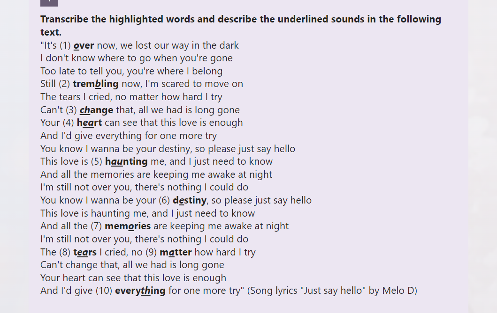

- **Part 1. Phonology**
	- Transcribe the highlighted words and describe the underlined sounds in the following text.
	  "It's (1) over now, we lost our way in the dark
	  I don't know where to go when you're gone
	  Too late to tell you, you're where I belong
	  Still (2) trembling now, I'm scared to move on
	  The tears I cried, no matter how hard I try
	  Can't (3) change that, all we had is long gone
	  Your (4) heart can see that this love is enough
	  And I'd give everything for one more try
	  You know I wanna be your destiny, so please just say hello
	  This love is (5) haunting me, and I just need to know
	  And all the memories are keeping me awake at night
	  I'm still not over you, there's nothing I could do
	  You know I wanna be your (6) destiny, so please just say hello
	  This love is haunting me, and I just need to know
	  And all the (7) memories are keeping me awake at night
	  I'm still not over you, there's nothing I could do
	  The (8) tears I cried, no (9) matter how hard I try
	  Can't change that, all we had is long gone
	  Your heart can see that this love is enough
	  And I'd give (10) everything for one more try" (Song lyrics "Just say hello" by Melo D)
		- 
		-
	- Find the words in the following text that can form minimal pairs with the highlighted words.
	  "In the vibrant tapestry of a student's love life, emotions often weave a complex and colorful pattern. As young hearts embark on this journey, they may shy away from expressing their feelings, unsure of what to say or how to throw themselves into the adventure of love. Yet, with time, they will find their way, guided by the wisdom of laughter and the warmth of shared experiences. Love, like a delicate thread of wool, has the power to mend and strengthen the bonds between two souls. As these relationships grow, they learn that sometimes saying "bye" can be the most difficult part, yet it's a testament to the beautiful moments they've shared. Through the ups and downs, students learn that love is a vital aspect of their personal growth, an essential part of their unique journey."
- **Part 2. Morphology**
	- Read this text again. Point out at least 2 words (different parts of speech) that contain the specific types of morphemes as required. Write the morphemic analysis of each word for illustration.
	  a) {...}: lexical morpheme, content word + {...}: lexical morpheme, derivational suffix
	  b) {...}: lexical morpheme, content word + {...}: grammatical morpheme, inflectional affix 
	  c) {...}: lexical morpheme, derivational prefix + {...}: lexical morpheme, content word
	  d) grammatical morpheme, function word
	  
	  
	  In the vibrant tapestry of a student's love life, emotions often weave a complex and colorful pattern. As young hearts embark on this journey, they may shy away from expressing their feelings, unsure of what to say or how to throw themselves into the adventure of love. Yet, with time, they will find their way, guided by the wisdom of laughter and the warmth of shared experiences. Love, like a delicate thread of wool, has the power to mend and strengthen the bonds between two souls. As these relationships grow, they learn that sometimes saying "bye" can be the most difficult part, yet it's a testament to the beautiful moments they've shared. Through the ups and downs, students learn that love is a vital aspect of their personal growth, an essential part of their unique journey
	- Analyse the following words morphologically. (E.g. hearts: heart: free root, content word + -s: bound morph, inflectional suffix)
	  
	  a) strengthen
	  b) warmth
	  c) relationships
	  d) vital