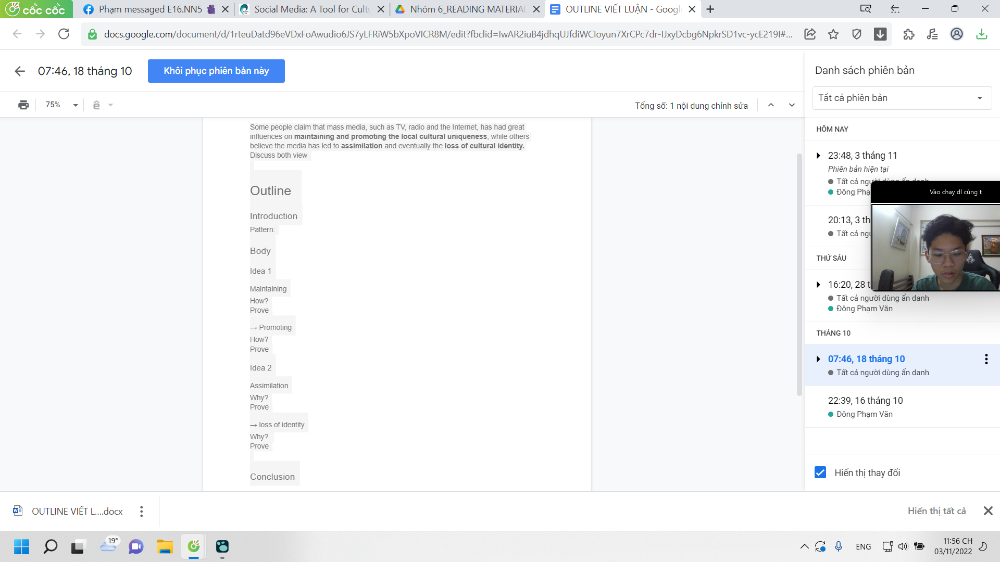

- Tôi
	- mắc ở đâu
- Và bọn nó
- Chúng tôi làm gì khi họp
	- ngồi đọc và anonate
	- chưa làm outline
	- làm nốt references
		- cả lũ quên cách site APA
- 
- [OUTLINE VIẾT LUẬN.docx](../assets/OUTLINE_VIẾT_LUẬN_1667494589395_0.docx)
-