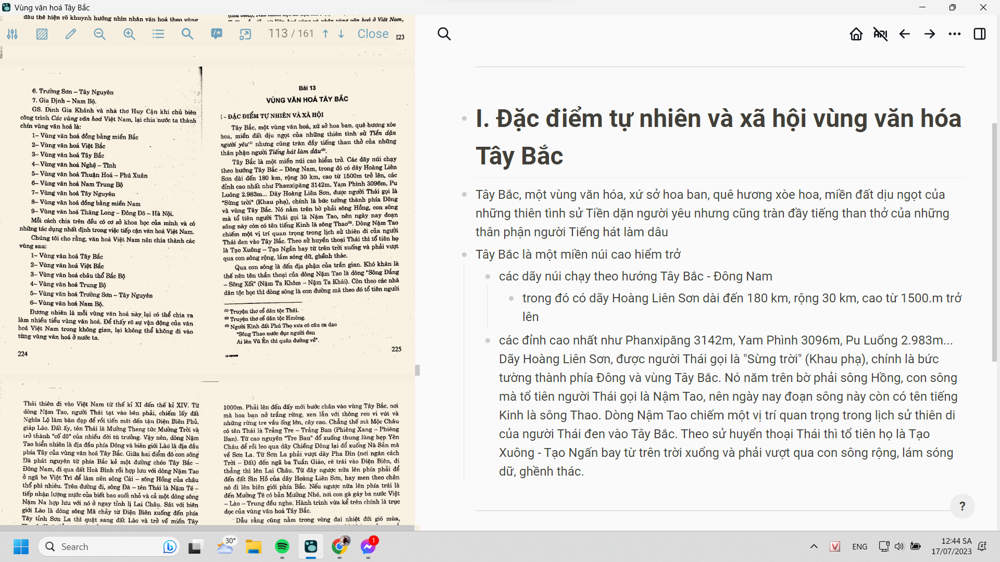

meta:: ((647fbd88-5a79-41c1-9860-08fe34cb9fb4)) (tr 225 - 238)

- ---
- # I. Đặc điểm tự nhiên và xã hội
  collapsed:: true
	- Tây Bắc, một vùng văn hóa, xứ sở hoa ban, quê hương xòe hoa, miền đất dịu ngọt của những thiên tình sử Tiền dặn người yêu nhưng cũng tràn đầy tiếng than thở của những thân phận người Tiếng hát làm dâu
	- ## Địa hình
	  collapsed:: true
		- Tây Bắc là một miền núi cao hiểm trở
		  collapsed:: true
			- các dãy núi chạy theo hướng Tây Bắc - Đông Nam
				- các đỉnh cao nhất như
					- Phanxipăng 3142m
					- Yam Phình 3096m
					- Pu Luổng 2.983m...
					- trong đó có dãy Hoàng Liên Sơn
						- dài đến 180 km, rộng 30 km, cao từ 1500.m trở lên
						- được người Thái gọi là "Sừng trời" (Khau phạ)
						- là bức tường thành phía Đông và vùng Tây Bắc
						- nằm trên bờ phải sông Hồng
							- con sông mà tổ tiên người Thái gọi là Nậm Tao
							- ngày nay đoạn sông này còn có tên tiếng Kinh là sông Thao
							- dòng Nậm Tao chiếm một vị trí quan trọng trong lịch sử thiên di của người Thái đen vào Tây Bắc.
		- Theo sử huyền thoại Thái, tổ tiên họ là Tạo Xuông - Tạo Ngấn bay từ trên trời xuổng và phải vượt qua con sông Hồng rộng, lắm sóng dữ, ghềnh thác để qua con sông đến địa phận của trấn gian
		  collapsed:: true
			- khó khăn là thế nên tên thần thoại của dòng Nặm Tao là dòng "Sông Đáng - Sông Xối" (Nặm Ta Khôm - Nậm Ta Khái)
			- còn theo các nhà dân tộc học thì dòng sông là con đường mà theo đó tổ tiên người Thái thiên di vào Việt Nam từ thế kỉ XI đến thế kỉ XIV.
			- từ dòng Nậm Tao, người Thái tạt vào bên phải, chiếm lấy đất Nghĩa Lô làm bàn đạp để rổi tiến mãi đến tận Điện Biên Phủ, giáp Lào
				- đất ấy, tên Thái là Mường Theng tức Mường Tròi và trờ thành "cố đô" của nhiễu đời tù trưởng
			- => dòng Nặm Tao là địa đầu phía Đông và biên giới Lào là địa đầu phía Tây của vùng văn hóa Tây Bắc
			-
			- giữa hai điểm đó con sông Đà phát nguyên từ phía Bắc kẻ một đường chéo Tây Bắc - Đông Nam, đi qua đất Hòa Bình rồi hợp lưu với dòng Nậm Tao ở ngã ba Việt Trì để làm nên sông Cái - sông Hồng của châu thổ phì nhiêu
			- trên đường đi, sông Đà - tên Thái, là Nặm Té - tiếp nhận lượng nước của biết bao suối nhỏ và cả một dòng sông Nặm Na hợp lưu với nó ở ngay tỉnh lộ Lai Châu
			- sát với biên giới Lào là dọng sông Mã chảy từ Điện Biên xuống đến phía Tây tỉnh Sơn La thì quặt sang đất Lào và trờ về miền Tây Thanh Hóa để xuôi về biển
			- => đất Tây Bắc còn được đồng bào gọi là đất ba con sông, tạo nên ba dài "nước màu: trắng, xanh, đỏ"
				- bởi vì sông Mã lắm thác ghềnh nên nhiều sóng bạc đầu
					- Lại còn có truyễn thuyết dòng sông là nữ thần canh giữ mỏ bạc mà xưa kia người Thái - La Ha thường khai thác
				- dòng Nậm Té (sông Đà) chảy giữa các triền núi đá granit, sâu thẳm xanh đen một màu
				- còn dòng Nậm Tao mang nặng phù sa thì chính người Kinh cũng gọi là sông Hồng.
			- ba con sống tự nhiên nhưng trở thành biểu tượng riêng của vùng đất
				- chúng lại có ba màu của nắng, của cây và của đất
				- chúng biến thành những tín hiệu văn hóa vùng mà người dân bản địa lấy đó làm tự hào, để phân biệt với người vùng "muối" (Kinh), người vùng sông Lô, sông Chảy (Tày, Nùng) v.v...
		- Hành trình trục dọc của vùng văn hóa Tây Bắc:
		  collapsed:: true
			- Từ dưới xuôi đi lên phải qua đất tỉnh Hòa Bình, xưa kia phải vượt sông Đà ở bến chợ Bờ và Suối Rút, rồi phải leo gần 100km đèo mới đến được cao nguyên Mộc Châu, cao 800-1000m.
			- Phải lên đến đấy mới bước chân vào vùng Tây Bắc, nơi mà hoa ban nở trắng rừng, xen lẫn với thông reo vỉ vút và những rừng tre vầu ống lớn, cây cao. Chẳng thể mà Mộc Châu có tên Thái là Trảng Tre - Trảng Ban (Phiêng Xang - Phiêng Ban).
			- Từ cao nguyên "Tre Ban" đổ xuống thung lũng hẹp Yên Châu để rồi leo qua đãy Chiềng Đông lại đó xuống Nà Sản mà về Sơn La
			- Từ Sơn La phải vượt dãy Pha Din (nơi ngăn cách Trời - Đất) đến ngã ba Tuấn Giáo, rẽ trái vào Điện Biên, đi thẳng thì lên Lai Châu.
			- Từ đây ngược nữa lên phía phải để đến đất Sìn Hồ của dãy Hoàng Liên Sơn, hay men theo chân nó đi lên biên giới phía Bắc.
			- Nếu ngược nửa lên phía trái là đến Mường Tè có bản Mường Nhé, nơi con gà gáy ba nước Việt - Lào - Trung đều nghe.
	- ## Khí hậu
	  collapsed:: true
		- Dẫu rằng cũng nằm trong vòng đai nhiệt đới gió mùa, nhưng do ở một độ cao từ 800-3000m nên khí hậu ngả sang ở nhiệt đới và nhiều nơi cao như Sìn Hồ có cả khí hậu ôn đới.
		- Đã thế, địa hình lại chia cắt bởi các dãy núi, các dòng sông, khe suối, tạo nên những thung lũng, có nơi lớn thành lòng chảo như vùng Nghĩa Lộ, Điện Biên.
		- Do vậy, Tây Bắc còn là nơi có nhiều tiểu vùng khí hậu.
			- Trong lúc đó ở thung lủng Mường Lau người ta mặc áo ngắn tay giữa mùa đông thì ở Mộc Châu phải mặc áo bông dầy mà không khỏi rét.
		- Nhưng chính vì vậy mà thiên nhiên Tây Bắc rất da dạng, thổ nhưỡng nhiều loại hình.
	- ## Dân sinh
	  collapsed:: true
		- Dân số tháp, năm 1973 mới có 59 ng/km2. Với tỉ lệ tăng 3,5%/năm cộng với việc di dân, đến năm 1990 cũng chỉ có 120 nguôi/km2. Cư dân cổ truyền, những chủ nhân từ xa xưa của Tây Bắc, đều làm nông nghiệp với hai loại hình: ruộng nước ở thung lũng và nương rẫy ở sườn núi.
		- Câu ngạn ngữ Thái đã nói:
			- *Xá ăn theo lửa*
			  *Thái ân theo nước*
			  *H’mông ăn theo sương mù.*
		- Người Thái, tộc người đa số trong vùng, làm ruộng nước trong các thung lũng, các vùng lòng chảo.
		- Người Mường và một bộ phận người Dao cũng thế.
		- Nhưng ngay những tộc người này củng phải làm thêm nương rẫy thì mới đủ sống.
		- Người Xá - theo tên gọi miệt thị xưa, bao gồm nhiều tộc khác nhau như Khơmú, Laha, Kháng, Mảng Xinhmun..., làm nương theo phương pháp thô sơ: phát rừng, đốt lấy tro, chọc lỗ tra hạt.
		- Còn người H’mông thường ở núi cao, cũng phát rừng, nhưng lại biết dọn gốc, cày xới làm nương thâm canh.
		- Ruộng và nương chỉ giải quyết được lương thực và một phấn rau xanh. Thịt, cá, rau và cả lương thực khi mất mùa, đều còn phải trông vào hái lượm, săn bắt.
		- Chẳng thế mà đồng bào có câu:
			- *Cơm nước ở mặt đất*
			  *Thức ăn ở trong rừng*
	- ## Tên gọi
	  collapsed:: true
		- Tây Bắc thực ra là tên gọi theo phương vị, lấy Thủ đô Hà Nội làm điểm chuẩn, hiện tại là địa bàn gồm bốn tỉnh Lai Châu, Lào Cai, Sơn La, Yên Bái.
		- Khi nói đến vùng văn hóa Tây Bắc thì phải kể một phần tỉnh Hoà Bình nữa.
		- Năm 1955 đổi thành khu tự trị Tây Bắc, vì tên cũ Khu Tự trị Thái Mèo không phản ánh hết tên của gần hai chục dân tộc sinh sống ở đây.
	- ## Dân cư
	  collapsed:: true
		- Chỉ kể những dân tộc tương đối đông dân ta đã có Thái (với các ngành Đen, Trắng, Đỏ), H’mông (với các ngành Tráng, Xanh, Đen, Hoa), Dao (với các ngành Quần chẹt, Nga Hoàng, Dao đỏ), Mường, Khơmú, Laha, Xinhmun, Tày.
		- Ngoài ra, còn có một bộ phận người Kinh vốn là con cháu nghĩa binh Hoàng Công Chất đã sóng lâu đời ở đây và một bộ phận người Hoa, vốn là dòng dõi quản Lưu Vĩnh Phúc.
	- ## Lịch sử văn hóa
	  collapsed:: true
		- Mỗi dân tộc đều có văn hóa mang bản sắc riêng. Quả là khó khi muốn nói về văn hóa cả vùng với một quần thể cư dân đa dạng như thế. Nhưng dẫu sao tính chất vùng của văn hóa Tây Bắc vẫn được hiện ra lồ lộ, không thể phủ định được. Cần phải ngược dòng lịch sử, nhưng không thể quá xa vì chẳng lấy đâu ra chứng cứ. Và chăng, chỉ cần chạm đến đầu công nguyên là đã bắt gặp cái văn hóa cơ tầng của miền đất này rồi.
		- Thuở ấy, cư dân Tây Bắc vẫn là một bộ phận của nền văn minh đồng thau Đông Sơn với trống đồng và công cụ bằng đồng, những thứ mà ngày nay đã trở thành vật thiêng, chỉ dùng trong các nghi lễ thờ cúng tổ tiên.
		-
		- Trong số cư dân ấy, **người Kháng** có tục uống nước bằng mũi (Ta mui).
		  collapsed:: true
			- nước măng chua, hòa tỏi, rau thơm, gạn lấy nước, đổ vào vỏ quả bầu mận, cho chảy vào mũi, trong lúc ấy miệng thì nhai cá hay thịt.
		- Cách uống này vẫn còn thấy ở người Kháng sống ở ven sông Đà, phía bên Tà Xại, Sơn La.
		- Đặc biệt người Kháng rất giỏi làm thuyên độc mộc.
		  collapsed:: true
			- người Thái phải công nhận "thuyền tốt không gì bằng thuyên Kháng".
		-
		- Còn **người Laha** thì mãi đến ngày nay vẫn được người Thái tôn sùng vì được coi là chủ nhân trống đồng
		  collapsed:: true
			- bởi vì cả người Laha lẫn người Thái đều có trống đồng làm vật thiêng, có thần trú ngụ trong đó.
		- Người Laha củng nổi tiếng về hội lễ "Mừng mùa măng mọc" với điệu múa thực khí sinh động, rộn ràng trong tiếng đệm của một đàn ống tre rỗng, đỡ trên tấm ván với những cô gái nhún nhảy múa.
		-
		- Đến những năm 60 của thế kỉ này **người Mảng** vẫn còn bảo lưu xăm những chấm, những vòng tròn có chấm ở giữa, quanh miệng và cằm
			- vì thế người Thái gọi họ là "Xá cằm hoa" (Xả cang Lái), tức người Xá cằm xăm hoa
		-
		- Tất cả những nét đặc trưng như trống đồng, thuyền độc mộc, nhạc cụ tre nứa, tục xâm mình, đều như phảng phất những gì đã từng được sách chữ Hán cũng như các truyền thuyết nói về xứ sở của các vua Hùng.
		- "Vào khoảng thế kỉ XI-XII, một bộ phận tổ tiên ngành Thái đen... do Tạo Ngần thiên di xuống chiếm "miền Mường Lò mà cảnh đồng Nghỉa Lộ là trung tâm". Cháu Tạo Ngần "là Lạng Chượng cầm binh đánh thắng dẫn các bộ tộc Nam Á từ Nghĩa Lộ qua Sơn La và tới Điện Biên.... cuộc hành trình của Lạng Chượng mở đầu giai đoạn bọn thống trị Thái làm chủ miền Tây Bắc."
		- Theo sách dã sử và truyền thuyết của chính người Thái, Lạng Chương phải chật vật lắm mới thắng nổi quân Nam Á.
		- Truyền thuyết Thái kể rằng : "quân Xá" (tức Nam Á) có tên làm bằng đồng sắc nhọn, quân Thái chỉ có tên tre. Lạng Chượng mối lập mưu thách nhau bán xem tên ai cám vào đá là thắng. Quân Xá bắn tên đồng vào đá thì bật ra. Quân Thái nạp cục sáp ong vào đấu tên tre nên bán vào đá thì dính. Quân Xá chịu thua, phải để quân Thái chiếm đất, còn quân Xá phải chạy vào rừng sâu mà ở.
		- Truyền thuyết cũng kể ràng quân Xá thua, chẳng những mất đất mà còn phải dâng trống (đồng) cho quân Thái. Từ đấy các dân tộc Nam Á suy thoái dần, nền văn hóa huy hoàng thuở ấy bị mai một rất nhiều. Ngày nay, trong văn hóa của họ đã có nhiều yếu tố Thái. Chẳng hạn, họ đã hoàn toàn quên mất nền âm nhạc của mình mà chỉ còn biết sử dụng các làn điệu Thái để hát.
		- Ngược lại, người Thái lại học được rất nhiều từ văn hóa của những người bản địa chiến bại, khiến cho văn hóa Thái (đặc biệt là Thái Đen) Tây Bắc loại biệt hẳn với văn hóa những người anh em chung cội nguồn của họ như người Tày phía Đông và người Lào phía Tây. Chính quá trình hỗn dung và tiếp biến văn hóa đó đã tạo nên sác thái vùng văn hóa Tây Bắc, thông qua văn hóa Thái là chủ thể.
- # II. Đặc điểm vùng văn hóa Tây Bắc
	- Từ mươi thế kỉ trở lại đây, với vai trò chủ thể trong lịch sử phát triển của vùng, văn hóa Thái (với những yếu tố tiếp biến từ văn hóa Đông Nam Á) nổi lên như một sắc thái đại diện cho văn hóa Tây Bắc.
	- ## Văn hóa đời thường
		- Từ cao nguyên Mộc Châu xuôi xuống thung lũng Yên Châu ở phía Bắc là đã bắt gặp những ngôi nhà sàn ẩn hiện sau những dãy cây xoài, rặng chuối. Nhà sàn thì có ở khắp cả Đông Nam Á. Nhưng nhà sàn Thái có cái mái đấu hồi khum khum hình mai rùa và trên đỉnh đấu hồi ấy có hai vật trang trí, người Thái gọi là "Sừng cuộn" (Khau cút) vì đấu phía trên của nó thường được tạo tác thành một vòng tròn xoáy trôn ốc, giống như ngọn rau đớn (Phắc cút), một thứ rau rừng rất được đồng bào ưa chuộng.
		- Bản Thái thường nằm ở ven đồi, chân núi, nhìn ra cánh đồng, ở đây thế nào cũng có ít nhất một dòng suối to nhỏ tùy nơi. Bản nào ở chân núi đá thì hay dùng mạch nước ngầm làm nước ăn, gọi là "Mỏ nước” (Bó nậm). Văn hóa nông nghiệp thung lũng Thái nổi tiếng vì hệ thống tưới tiêu, được gói gọn trong bốn từ văn vần "Mương - Phai -  Lái - Lin".
		  collapsed:: true
			- lợi dụng độ dốc của dòng chảy, người ta lấy đá ngàn suối làm nước dâng cao, đó là cái "phai"
			- phía trên "phai” xẻ một đường chảy lớn dẫn vào cánh đống, đó là "mương"
			- từ "mương" xẻ những rãnh chảy vào ruộng, đó là "lái
			- còn "lin" là cách lấy nước từ nguồn trên núi cao, dẫn về ruộng, về nhà, bằng các cây tre đục rỗng mấu, nối tiếp nhau, có khi dài hàng cây số.
			- người Kinh vùng núi Phú Thọ (cũ) học theo cách làm này và gọi chệch đi là "lần nước".
		- Do chủ động tưới tiêu nên người Thái nuôi cá ngay trong mực nước của ruộng lúa. Gặt lúa xong là tháo nước bắt cá.
		  collapsed:: true
			- cá nuôi trong ruộng vừa ăn sâu bọ cỏ dại, vừa sục bùn cho tốt lúa. Cho nên, món dâng cúng trong lễ cơm mới bao giờ cũng có xôi và cá nướng.
		- Món cá là biểu hiện lòng hiếu khách:
		  collapsed:: true
			- "*Đi ăn cá, về nhà uống rượu*
			  *Ở thì ngủ đêm, đắp chăn ấm"*
		- Những dòng suối còn đóng vai trò quan trọng trong tâm linh con người.
			- suối được coi là vật nữ tính : "con suối" (Me nặm)
			- suối lại là nơi trú ngụ của thần nước, thường ở những đoạn nước cuốn thành vực (Vắng nặm)
			- hàng năm, khi làm lễ cúng bản (Xên bản) vào mùa xuân, người ta tổ chức ngay trên bờ vực nước đó
		- Có một tâm thức tín ngưỡng với nước là đặc điểm chung của các tộc người làm nông nghiệp {{cloze cái ý này nếu không có ý dưới thì mình sẽ không cho nó được tách thành ý lớn mà chỉ coi là một sự suy dẫn ra từ ý kia, cái việc cái nào suy, cái nào bổ sung chứng minh như nào ở trong một ý lớn thì chắc phải tự xem tự biết qua các từ nối chẳng hạn thôi chứ kí hiệu vào thì hmm hơi cồng kênh? nhưng nếu cho máy dễ phân biệt nhanh, để trả lời một câu hỏi gần nghĩa thì phải làm thế}}
		  collapsed:: true
			- ở người Thái, tâm thức đó được "thể chế hóa" bằng hình tượng thần nước dưới dạng thuồng luổng và bằng các lễ cụ thể.
		- Con suối và cánh đồng, những sản phẩm sáng tạo và chiếm lĩnh của con người, cũng đã đi vào thơ ca, âm nhạc như những hình tượng đẹp của cảm xúc thẩm mỉ như lời bài dân ca sau :
		  collapsed:: true
			- *Đêm trăng sáng,*
			  *Tăm hồn em như muốn phiêu diêu*
			  *Chơi tha thẩn bên bờ cát trắng*
			  *Bờ cát trắng lắp lánh ánh trăng*
			  *Chờ tiếng sáo anh*
			  *Luôn qua sương, luồn qua chăn núi*
			  *Đến với em trong ánh trăng ngời ngòi.*
		- Nương rẫy là một bộ phận bổ sung không thể thiếu
			- với nương, đồng bào có lúa, rau quả như bấu bí, rau cải, đậu, đu đủ, vừng, kê, ớt v.v...
			- bông và chàm cũng trồng trên nương
		- Rừng, rừng bạt ngàn là nơi con người hái rau rừng, lấy thuốc chữa bệnh, thuốc nhuộm, săn bắt thú rừng và khi thất bát mùa màng thì chính rừng, với củ mãi, bột báng đã cứu họ khỏi chết đói.
		- Bản làng có một thái độ rẫt kính trọng với rừng.
			- chẳng phải vì rừng có ma thiêng, mà vì rừng là nơi con người nương tựa để tồn tại
			- luật Thái có hàng chực đìéu quy định về việc khai thác rừng, săn bán thú, đặc biệt là những quy định về bảo vệ rừng đầu nguồn
		- Người Thái bảo vệ rừng ban
		  collapsed:: true
			- vì nó là biểu tượng văn hóa của quê hương họ
			- và vì chỉ có ban mới mọc được ở nơi đất cằn.
			- nhờ có ban giờ lại mùn từ trên cao chảy xuống
				- đất cằn tái sinh
				- mùn rác không lấp ruộng, nghẽn suối
				- nước mưa ngám vào lòng đất ngăn những cơn lũ ống
		- Chỉ riêng cách ứng xử với cây ban cũng đủ thấy đặc trưng văn hóa Thái nói riêng, Tây Bắc nói chung có một trình độ khoa học thế nào, có tính nhân văn ra sao trong cái nhìn sinh thái học
		- Chẳng riêng gì người Thái, cả người H’mông trên núi cao, người Khơmú, người Dao, người Kháng, Laha,... trong rừng sâu đều tự nguyện tuân theo luật Thái
		  collapsed:: true
			- điều đó không đơn thuần vì giai cấp thống trị Tây Bắc trước kia là thuộc tộc Thái, mà điều quan trọng là ở chỗ, đây cũng là quyền lợi lâu dài của tất cả các dân tộc trong vùng
		- Cũng như hầu hết các dân tộc trong vùng, người Thái sống chân thật, giản dị và rất hòa thuận
			- trong gia đình, trong bản không bao giờ thấy người ta to tiếng với nhau.
			- đặc biệt không bao giờ trẻ con bị mắng mỏ nặng lời, chứ không nói đến việc bị đánh đòn
			- trẻ con hiểu nhiệm vụ của chúng và rất tự giác thực hiện
				- chúng có sai sót gì, người lớn chỉ nhắc nhẹ
			- trẻ em rất ngoan, chúng chơi đùa với nhau rất thân ái
			- gặp lúc khó khăn, đói kém người ta đến họ hàng xin lương thực, người được hỏi xin sẵn sàng chia sẻ số lương thực còn lại
				- dù biết rằng sau đó chính họ củng sẽ lâm vào cảnh thiếu đói và cũng phải lên rừng đào củ mài, củ bớn thay cơm
			- Ngay bây giờ, khi nền kinh tế thị trường đã có tác động vào đời sống cư dân Tây Bắc, thì phong tục này vẫn được thực hiện với tấm lòng vị tha và tình nghĩa sằu đậm. {{cloze mình có thể làm tổng phân hợp kiểu này, còn quy nạp thì ý cuối sẽ in đậm và cách dòng với đoạn sau chẳng hạn}}
		- Nhân đây cần nói ngay rằng nếp sống hòa thuận, tôn trọng người già, thương yêu con trẻ và giúp đỡ nhau vô tư là đặc điểm chung của các dân tộc trong vùng. Những kì thị dân tộc không phải không có, nhưng rất hiếm và phần nhiều là cách đánh giá của giới quý tộc Thái, còn giữa những người lao động thì hầu như không có.
			- cho nên, khi đói kém, anh em H'mông ở núi cao xuống, bà con Khơmú, Mảng trong rừng sâu ra, bản Thái sẵn sàng chia sẻ.
			- ngược lại, cũng có năm, bản Thái lũ lượt kéo nhau lên núi cao để khi về kĩu kịt những tặng phẩm của bà con người H’mông.
			- vào những năm tháng kháng chiến chống Pháp, chống Mỹ, đồng bào Thái lại được anh em các dân tộc Nam Á giúp đỡ tận tình ở nơi sơ tán.
		- Nhìn nhận hiện tượng này, các nhà kinh tế học cho rằng đó là hệ quả của một xã hội chưa biết đến thương nghiệp với vật ngang giá là đồng tiền. Củng có thể là như vậy.
		- Nhưng nếu tiếp cận từ góc nhìn văn hóa thì cũng phải công nhận đây là một thuần phong mĩ tục trong quan hệ giữa người các dân tộc với nhau.
			- nếu không thế thì không thể giải thích được, vì sao ngày nay trong cơ chế kinh tế thị trường, phong tục truyền thống vẫn được giữ vững và sẽ không hiểu thế nào được sự tồn tại suốt mấy chục năm của các "quán tự giác" trên khắp nẻo đường Tây Bắc.
				- đồng bào treo chuối, mía, trứng, để giá tiền vào từng loại, khách qua đường tự lấy ăn rồi bỏ tiền vào cái túi vải treo cạnh đó.
				- khách có tiền lớn thì có thể đổ tiền trong túi ra, tự lấy tiền thừa rồi bỏ tiền của mình và số tiền sẵn có của quán hàng trở lại vào túi
				- chủ quán không có mặt, nhưng chẳng ai dám cả gan ăn cắp kể cả những lái xe người Kinh "thích đùa" đi qua đường
	- ## Tín ngưỡng
		- Các dân tộc trong vùng đều có tín ngưỡng "mọi vật có linh hồn" (animisme)
		  collapsed:: true
			- một loại tín ngưỡng mà mọi dân tộc trên hành tinh đều trải qua
		- Có đủ loại hồn và các loại thần
		  collapsed:: true
			- thần sông núi, suối khe, đá, cây, súc vật
			- các lực lượng thiên nhiên như sấm, chớp, mưa, gió
		- Các bộ phận trên thân thể con người cũng có hồn
		  collapsed:: true
			- người Kinh cho rằng
				- có ba hồn bảy vía (nam)
				- ba bồn chín vía (nữ)
			- người Thái có đến 80 hồn
				- xam xíp khoăn mang nả, hả xếp khoăn mang lăng
				- như hồn lông mày, lông mi, tai, mũi, trán,...
		- Người chết không biến mất mà trở về sống ở bản của tổ tiên
		- Do chỗ mọi vật đều có hồn nên cần phải cư xử với chúng như trong quan hệ với người
		  collapsed:: true
			- Vì vậy, có hồn tốt, hồn xấu, hồn ác, hồn lành tùy thuộc vào cách đối xử của người với chúng
		- Vào hoàn cảnh xã hội cổ truyền thì đây là cách chiếm lĩnh thiên nhiên và thực tại của đồng bào
		  collapsed:: true
			- với hi vọng có thể "nói chuyện", có thể "thương lượng", thậm chí khi cần thì "cầu xin" chúng
			- => đồng bào thiết lập được mối quan hệ với mọi vật và tổ tiên, đặt con người vào tổng thể môi trường không gian và thời gian, tạo nên một sự cân bằng trong tâm thức
		- => Con người hội tụ vào cuộc sống hiện hữu của mình các miền thời gian: quá khứ, hiện tại, tương lai và các chiều không gian, thiên nhiên, môi trường, con người, xã hội. Đó chính là mối quan hệ đa diện, đa phương đảm bảo cho tính hợp lí và sự ổn định tất yếu của cuộc sống con người
		- Thiết tưởng, với trình độ khoa học kĩ thuật chưa phát triển thì cách nhận thức thế giới theo phương pháp huyền thoại, tín ngưỡng này không phải không có tác dụng tích cực cho sự tồn tại của cộng đồng và con người
	- ## Văn hóa nghệ thuật
		- Văn hóa nghệ thuật, lĩnh vực văn hóa thể hiện cái nhìn thẩm mĩ của nhân dân Tây Bắc có nhiều nét độc đáo và trở thành một trong những dấu hiệu làm nên đặc trưng văn hóa vùng
		- Riêng về lĩnh vực này đã phải cần đến một công trình lớn mới có thể trình bày cho cặn kẽ được. Cho nên, một vài điều nêu ra đây may mắn lắm cũng chỉ là những nét chấm phá vào một toàn cảnh lớn lao, hoành tráng và mang đậm tính dân gian.
		- ---
		- ### Văn học
			- Trong xã hội cổ truyền Tây Bắc, văn hóa chuyên nghiệp, bác học chưa xuất hiện, ở người Thái tuy đã có một vài nghệ nhân giỏi sáng tác thơ ca nổi tiếng và mặc dù dân tộc này có chữ viết cổ, nhưng tác phẩm của họ vẫn lưu truyền chủ yếu bằng phương thức truyền miệng.
			- Mỗi dân tộc trong vùng đều có một kho vốn sáng tác ngôn từ giàu có và đủ thể loại
				- từ tục ngữ, thành ngữ, đồng dao, giao duyên, cho đến lời khấn, lời bùa chú, các áng văn trong lễ tang, trong lễ hội, các bài văn vần dạy bảo đạo đức cho dâu rể trong đám cưới, các thần thoại, đồng thoại, cổ tích, truyện cười v,v,...
				- ở một số dân tộc có cả truyện thơ dài hàng ngàn câu như Tiễn dặn người yêu" (Thái), Tiếng hát làm dâu (H’mông), Vườn hoa núi Cối (Mường) v.v...
				- người Thái còn có cả truyện thơ lịch sử, kể lại quá trình thiên di của họ vào Tây Bắc như bản sử ca *Dõi theo bước đường chinh chiến của ông cha* (Táy pú Xớc) hay *Lịch sử bản mường* (Quán tố mướng) ngay đến lời hát của các Mothen trong lễ cúng người ốm cũng là một áng du kí ca đầy hình tượng đẹp được diễn tả bằng văn phong trau chuốt
				- bộ phận người Mường Tây Bắc cũng có những thiên sử thi như ở Hòa Bình, Thanh Hóa.
					- ngoài ra, do đã tách ra từ mấy thế kỉ và sống giữa những cộng đồng tộc người khác, nên người Mường Tây Bắc còn có những áng văn hiếm thấy ở các vùng Mường như *Vườn hoa - Núi cói* chẳng hạn.
			- Các truyền thuyết của từng dân tộc, một mặt khẳng định nguồn gốc của họ với những nhóm đồng tộc cư trú ở các vùng văn hóa khác; mặt khác, lại gắn bó với vùng đất và trình diễn lịch sử của họ trên mảnh đất miền Tây, và góp phần làm nên dấu hiệu đặc trưng của vùng văn hóa Tây Bắc, Có thể gặp những truyền thuyết như thế trên từng bước chân.
				- đây là nơi chúa Thái và chúa Xá thi bắn xem tên ai xuyên vào đá, kia là nơi Nàng Han (một Gianđa Thái) tắm (Suối Nàng Han)
				- dãy núi ba chỏm kia là thi hài hóa đá của ba dũng tướng quên mình bảo vệ quê hương v.v...,
				- và đặc biệt là những truyền thuyết về hoa ban,
					- dân tộc nào cũng có và cũng thắm đượm tình người
		- ### Sân khấu
		  collapsed:: true
			- "Xòe" là đặc sản nghệ thuật múa Thái và trở thành biểu tượng văn hóa Tây Bắc.
				- người Thái có xòe vòng quanh đốm lửa, quanh hũ rượu cấn, với sự tham gia đông đảo của già trẻ, gái trai trong tiếng chiêng trống rộn ràng
				- nhưng cũng có xòe điệu của người Thái trắng ven sông Đà suốt từ Ngọc Chiến, Quỳnh Nhai lên đến Lai Châu, Phong Thổ.
				- tương truyền có đến 32 điệu xòe do các cô thanh nữ múa trong tiếng Tính Tảu dịu dàng của hai chàng trai.
				- xòe vòng sôi nổi bao nhiêu thì xòe điệu nhẹ nhàng, tinh tế bấy nhiêu
			- Người H’mông nổi tiếng về các điệu múa khèn, đá chân hùng dũng của nam giới.
			- Người Khơmú và Xinhmun lại độc quyền điệu múa lác mông, lượn eo.
			- Còn điệu Tăng bu (dỗ ống) là sở hữu của người Laha.
			- Và đến với người Mường thì phải được xem múa bông.
			- Riêng điệu múa xạp, trừ người H’mông còn dân tộc nào trong vùng cũng có, mỏi nơi một vẻ riêng.
			- => Có thể xem nghệ thuật múa dân tộc ìà một nét đặc trưng của vùng Tây Bắc.
		- ### Âm nhạc
			- Dường như có một sở thích âm nhạc chung cho hầu hết các dân tộc Tây Bắc, một sở thích không thấy hoặc ít thấy ở các vùng khác. Đó là hệ nhạc cụ hơi có lưỡi gà bằng tre bằng đồng hay bằng bạc.
				- nếu sưu tấm và gộp chung lại thì có đến vài chục loại hình thuộc hệ nhạc cụ này
				- nhiều loại đã được cả nước biết đến như Pí pặp, khèn bè Thái, sáo và khèn H’mông
			- Ngoài ra, mỗi dân tộc đều có bản sắc riêng như:
				- cây Tính Tảu Thái
				- Ôống ôi Mường
				- Hưn mạy Khơmú
				- đàn tròn và đàn ba dây Hà nhì v.v...
			- Ở nhiêu dân tộc khác, thơ ca Tây Bắc được sáng tác để hát, chứ không phải để đọc
				- những truyện thơ, những áng sử thi được trình diễn bằng cả những liên khúc âm nhạc mà nhiều bài trích ra từ đó đã được cả nước biết đến như bài "Inh lả ơi" chẳng hạn.
		- ### Mỹ thuật
			- Nét chung nữa trong văn hóa Tây Bắc là sở thích trang trí trang phục, chăn màn, đồ dùng với các sắc độ của gam màu nóng
				- rất nhiều màu đỏ, xen vào với vàng tươi, vàng đất, vàng rơm, rồi da cam, tím và nếu có xanh thì phải là xanh da trời tươi.
				- phải chăng giữa mênh mông xanh lá cây, những màu ánh lên như những điếm sáng, khẳng định sự có mặt của con người.
			- Còn họa tiết, bố cục, phối màu của trang trí thì rất nhiều và phong phú, từng sản phẩm đủ tầm có để phải làm riêng một chuyên khảo.
				- đến nỗi chỉ một chiếc khăn Piêu Thái
				- một bộ nữ phục H’mông, Lô Lô, Dao đỏ
				- một mặt chăn Mường
				- một điểm màn Kháng
		- Những nét chung của cả vùng không hố làm mất đi tính riêng của văn hóa dân tộc. Thậm chí, cùng một cốt truyện, ở mỗi dân tộc vẫn có thể tìm thấy cái riêng.
			- lấy một chuyện bi tính sử có ở nhiều dân tộc Tây Bắc làm ví dụ: "Một đôi trai gái yêu nhau, vì lí do nào đó họ không lấy được nhau và cùng tự tử chết"
			- truyền thuyết của các dân tộc khác nhau, đương nhiên sẽ kết thúc khác nhau
		- Hẳn là những nét phác họa ở đây nhiều lắm cũng chỉ là gợi mở về một vùng văn hóa đa dạng và độc đáo. Hi vọng rằng có thể dẫn dắt chút ít cho những ai muốn tìm hiểu sâu thêm về vùng văn hóa Tây Bắc.
- ---
- Mình không làm bài này dựa trên ý để ôn thi điểm cao dù đúng là có nhân cơ hội ôn thi vì điểm chứ không phải học chọn lọc cái gì mình cần, xem có cái gì dùng được cho mình không và dùng và đưa giáo viên, nên chia theo cấu trúc: chung -> riêng -> giải thích nếu cần
- dù thực chất một số ý tóm gọn lớn không tốt lắm và tỏ ra không cần lắm, còn các câu hỏi trong đề thì chọn dưới tiêu chí coi đó là điều cơ bản cần nhớ chứ không phải thông tin được tóm gọn cần biết nếu mình không cần đào sâu quá (nhưng cái tóm gọn đó vẫn hơi vô dụng). đôi khi nó nằm ở phần riêng nữa cơ
	- 
- mà phần này ông nào viết đọc thì giàu thông tin nhưng lung tung cấu trúc vl, nếu muốn sắp xếp thì phải phá tan cả bài ra rồi ghép thành ý, nó sẽ mất đi tính truyện nhưng từ những phần đã sắp xếp mình có thể xây nên những câu chuyện riêng.
- mà viết thế mà vẫn đủ các phần, dù thứ tự không hay ho lắm như tên gọi phải xếp trước. chắc cứ viết thôi, phần nào thiếu thì bổ sung sau một cách hơi thiếu liên kết tí, hoặc list ra sẵn những gì cần viết, ghép cái mạch vào và cứ thế phóng bút
- tự dưng mình lại nghĩ về việc có nên để: Topic Sentence
	- ý 1
	- ý 2
	- ý 3
- không phải vì 3 ý không quan trọng nhưng nhìn dưới góc độ search engine để trả lời câu hỏi, từ cái cloze trong bài, mình nghĩ đôi khi nó sẽ cần giải thích, hoặc không, vì lấy ý chính cũng đủ logic chính nó để hiểu mà chưa cần đào thêm tại sao ấy, còn nếu quan tâm tại sao để hiểu thì hẵng đào thêm.
	- cái hiểu của mày nó khác cái đọc để nhớ hoặc nhận biết của thi cử. mày sợ mày đang đi theo kiểu thi cử là chỉ lấy ý chính, cắt hết phần giải thích
	- nhưng mày đọc ý chính đôi khi mày có thể tự suy ra giải thích một cách nào đó để thuyết phục bản thân tin làm mà, còn mày muốn nó sát theo đúng logic vận hành thì có thể tự viết logic đó ra hoặc đọc lại những lí do bản chất
		- đôi khi mày có nhớ hoàn toàn các ý hay các mối liên kết của các khái niệm với nhau đâu nhưng mày vẫn nhớ cách hoạt động một cách không hiện thành hình được và cứ chém nó ra ở thực tại, áp thoải mái vào thực tại mà
		- việc duy nhất đôi khi cần nữa là xem lại cấu trúc xem đủ các phần chưa chứ cũng chẳng làm việc đến phần tại sao người ta nghĩ ra, tại sao người ta chọn phần này đặt ở đây, một số sự sáng tạo phá cách,...
		- và cũng bởi một số ý chứng minh cũng chỉ là một cách ra đáp án, một số định nghĩa cũng chỉ để làm rõ hơn chút chứ liệt kê sao hết được
			- mày cũng chỉ lòe bản thân, cảm giác biết rồi quên thì đỡ nhức nhối khi làm hơn là không biết, không tin được, có gì đó có thể không hợp lí
	- còn nếu mày quan tâm và muốn nhìn một cách rộng nhất thì mày cần diễn dịch, đó là cách hiểu tốt nhất.
	- quy nạp thực chất đề cao nội dung hơn hoặc nó là mạch kể lịch sử, thực ra mình cũng chẳng nhớ khi nào nên dùng thì tốt nhất nữa, tổng phân hợp có lẽ cũng chỉ để nhớ
		- mà logseq không design cho hai loại đấy và ở trong tri thức cũng không cần lắm
		- như kiểu mày không cần nhìn đến mức các phân tử tương tác như nào ở mọi chỗ, mày cần một số ví dụ ở một bài riêng rồi tự hình dung đối với những cái còn lại là được
	- còn nếu mày trân trọng các ý mày indent thì mày có thể chụp lại thực tại, đó là sự kết hợp đầy đủ nhất, đan xen nhằng nhịt, đơn giản mà phức tạp nhiều mối liên kết nhất, còn mày viết lại các mối liên kết, hoàn toàn nó là một thứ có thể thành chuyên đề riêng để so sánh tổng hợp hoặc ở một số cấu trúc góp phần tạo nên phạm trù này kia như cái page này, việc mày viết và cho nó một cấu trúc là mày đã cho nó thứ tự, đã phân cấp mà vốn mọi thứ đều bình đẳng liên kết như network
-