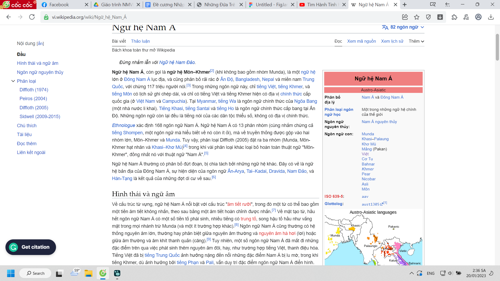

- J. L Taberd (1838) cho rằng tiếng Việt là một **chi nhánh của tiếng Hán**
  collapsed:: true
	- Tiếng Việt tưởng như chỉ là một hình thức thoái hóa của tiếng Hán hoặc như một sự pha trộn giữa tiếng Hán và thổ ngữ (với yếu tố tiếng Hán mang tính chủ đạo) {{cloze Không biết lí do gì mà họ cho là thế được nhỉ}}
- Nửa sau thế kỉ XIX, các nhà nghiên cứu nêu ra một khuynh hướng mới là tiếng Việt có **quan hệ họ hàng với các ngôn ngữ phương Nam** {{cloze vì lí do gì mà họ đam mê tìm hiểu lại và chất vấn lại nhỉ, hay do thấy còn có lỗ hổng, hay do sở thích cá nhân, sao trước đây không nhìn ra cái hướng mới này}}
- J.R. Logan (1856) đã đối chiếu từ ngữ theo khuynh hướng đó và đặt tên gọi cho một nhóm ngôn ngữ ông thấy gần gũi là Môn - Annam {{cloze khi làm phiên bản học ăn liền để mình hiểu chứ không có khả năng truyền lại, may ra thì có chút nhưng đặc biệt không đủ để xác lập một hệ thống kiến thức chuẩn từ từng từ ngữ miêu tả đến nội dung phục vụ cho mục đích tầm cỡ Machine Learning, mình nhận ra một điều là từ người ta trần thuật lại thế này cũng chỉ có tí tác dụng và đặc biệt nó là từ thuộc về người viết chứ không phải thuộc về kiến thức khách quan. Rốt cuộc ngôn ngữ cũng chỉ để giao tiếp chứ không để xác lập một thứ gì đó thực ở đời. Thế thì phải tìm ra loại ngôn ngữ đó và xác định các kiến thức lõi, khách quan để nhét vào}}
  collapsed:: true
	- về sau, các loạt công trình của C.J.S. Forber (1881), E. Kuhn (1889) cũng có ý kiến tương tự
- K. Himly (1884) trong cuốn "Các ngôn ngữ đơn lập ở Đông Nam Á" vẫn muốn xếp tiếng Việt vào **các ngôn ngữ họ Thái**
- Năm 1906, W. Schimitdt, người đưa ra các thuật ngữ "Các ngôn ngữ Môn - Khơmer" hiện đang được sử dụng rộng rãi lại **không coi** tiếng Việt là một **ngôn ngữ của họ Nam Á** {{cloze cách viết rõ ra như này, diễn dịch có vẻ hợp hơn là tổng phân hợp hay quy nạp. quy nạp thường dành cho tư duy và thể hiện tư duy, hoặc đôi khi kể chuyện cho đỡ chán; tổng phân hợp cũng là một cách để trình bày? còn diễn dịch là tối ưu nhất rồi, người ta sẽ chỉ quan tâm tiểu tiết nếu cần, cần thì ấn mở rộng xuống}}
- H. Maspéro (1912) xuất bản cuốn "Nghiên cứu về ngữ âm lịch sử tiếng Annam. Các phụ âm đầu" đã nhận định rằng "Tiếng tiền Annam đã sinh ra từ một sự biến hóa của một phương ngữ Môn - Khơmer, một phương ngữ Thái và có thể cả ngôn ngữ thứ ba chưa biết; rồi sau đó tiếng Annam đã mượn một số lượng lớn những từ tiếng Hán. Nhưng cái ngôn ngữ mà ảnh hưởng quyết định đã tạo ra cho tiếng Annam trạng thái hiện tại của nó là chắc chắn, theo ý kiến tôi, một ngôn ngữ Thái và *tôi nghĩ rằng tiếng Annam phải được quy vào họ Thái*" {{cloze sao không đối chiếu với lịch sử, hay tại lịch sử chỉ viết mấy chuyện đâu đâu chẳng liên quan gì đến việc quan hệ với ai, phát triển đi theo hướng nào (ừ thay vì vẽ lại lịch sử như một bước phát triển thì xem cả nhân loại đang đi đâu, thích đi đâu -rộng lớn hơn là những phương sách của các nhà lãnh đạo từng thười, có xu hướng đi đâu, ảo tưởng tí từ việc con người sống)ừ mà họ khám phá ra cái này chỉ bằng việc so sánh và khảo liệu từ đâu nhỉ, có giống khảo cổ không}}
  collapsed:: true
	- Về mặt **từ vựng**, không đủ cơ sở nói tiếng Việt là ngôn ngữ thuộc nhóm nào
		- tiếng Việt có **nhiều từ chung với nhiều ngôn ngữ Môn - Khơmer** (tiếng Môn, tiếng Khơmer, tiếng Banar, tiếng Stiêng, tiếng Rơngao, v.v...) nhưng không có nhóm nào là hoàn chỉnh
		- cũng có **không ít nhiều các từ gốc Thái** (tiếng Xiêm - tiếng Thái Lan ngày nay, tiếng Lào, tiếng Thái đen, Thái trắng, tiếng Thổ, tiếng Ahom, tiếng Shan, tiếng Dioi)
	- Về mặt **ngữ pháp**, cụ thể là **hình thái học**, tiếng Việt **gần với các ngôn ngữ Thái hơn**.
		- vì các môn ngữ Môn Khơmer vẫn tồn tại hệ thống tiền tố, trung tố để tạo từ phát sinh nhưng trong tiếng Việt hiện nay lại không có. Ở tiếng Mường là ngôn ngữ anh em gần với tiếng Việt cũng không có và cũng không có ở tiếng Xiêm, Lào, Thái trắng hoặc Thái đen ở Tây Bắc Việt Nam
	- Về thanh điệu, cả tiếng Việt và tiếng Mường đều là các ngôn ngữ thanh điệu và hệ thống thanh điệu **giống kiểu Thái**. Ngược lại, các ngôn ngữ Môn - Khơmer lại không có đặc điểm này
- {{cloze cứ tưởng mọi thứ kết thúc rồi nhưng còn dài lắm, 30 trang chứ chẳng đùa, mà trình bày vậy nắm thì nắm được nhưng cũng đếch hiểu lắm cụ thể những cái ý trên ra sao, (rồi người học, sau này người nghiên cứu cũng chỉ biết chứ có làm gì được lịch sử nữa đâu, phải chăng do cách viết lịch sử chắc nịch, không để lỗ hổng tư duy hay nói vấn đề bỏ ngỏ để họ làm gì đó lại với lịch sử) có bị ai phản biện lại không hay bản chất nó hơi hơi mơ hồ nhưng hồi đó đành chấp nhận, sau này có thứ gì đó thuộc một mảng khác đáng tin hơn thì người ta tin. Thế những phần có lí kia bỏ hết đi vì nhìn chung không có lí à, chẳng ai định liên kết và truy xem cái đó nghĩa là gì, hợp lí thì phải cố 100%. Dân Việt Nam nhục chưa để người ta nghiên cứu mình. Mà sao không ai liên kết tất cả lại, tổng hợp tất cả tài liệu, chưa đưa ra kết luận vội cũng được? Sẽ bớt bị hạn chế không nói tới ở đây là phạm trù nghiên cứu của những ông kia. Ôi đây lại là những câu hỏi buổi đầu những ngày học Việt ngữ. Nay hỏi cô cũng được nhưng hỏi thế có cảm giác bớt mệt là tiếp tục tự tra, còn ngược lại cô lại mệt, dù thực tế đây chỉ là cảm giác tâm lý chứ chẳng phải một hành động truyền, tiếp năng lượng. Sao học cái môn này mệt mỏi thế nhỉ, đi viết cho Nghi tạm để giải trí đầu óc vậy, hoặc smoke break bằng game, cũng tạm tư duy nốt ý nãy nghĩ hơi qua loa: liên kết tất cả lại, mình viết có lẽ diễn đạt rõ ra 90% cái muốn nói rồi nhưng cảm giác mới được 1/10 cái thực sự ý đó chạm tới. Liên kết là liên kết gì, tất cả các bài nghiên cứu, tất cả các phạm trù đã được nói kia, tất cả các cái lí và lí giải từng cái lí một, như một lịch sử của ngôn ngữ Việt? nó đã đi đâu, chào hỏi ai, thay đổi gì bởi những người xung quanh nó, các "người ngôn ngữ xung quanh nó", có ai ảnh hưởng nhiều tới nó không, đối tượng, tập đoàn phong kiến,...}}
- {{cloze chưa nghĩ ra hệ thống ở tầng vi mô - từ ngữ, dần quên tầng vĩ mô - cấu trúc, sự ảo tưởng về thành phố thư viện đang mờ nhạt dần vì quên và vì cái khó vi mô thực tế, thì chưa biết bao giờ xem lại và xử lí đống cloze này. Nhưng cứ xem lại theo thời gian và chia thành các mục, sâu nó lại theo từng bước, giải một rồi dần lên hai được, bồi đắp nhau, hoặc vô tình tìm được cả chuyên đề lí giải tất cả một câu hỏi trong mục đó luôn}}
- W. Schmidt (1926), R. Shafer (1942), A.I. Vlich (1956), Vương Lực (1958), H.J Pinnow (1963) đồng ý với ý kiến H. Maspéro.
  collapsed:: true
	- các ý kiến phản bác bị lu mờ vì uy tín của H. Maspéro
	- thuật ngữ Môn - Annam của Logan mai một đi
	- thuật ngữ Môn - Khơmer của Schmidt nổi hẳn lên để chỉ một nhánh ngôn ngữ có bà con họ hàng ở Đông Nam Á không bao gồm tiếng Việt.
	  collapsed:: true
		- {{cloze vẫn éo hiểu Môn - Khơmer liên quan gì, lần đầu nó được nhắc đến thì là được nhắc ở một thứ không liên quan, cứ như ngta kể chuyện song song như mạch phim, nma đây không phải phim. Tra ra mới thấy, dù lúc đầu mình định tra môn Annam}}
		- 
		- 
		- {{cloze bây h thì có 1 vde là trước giờ mình chỉ cố hình dung theo kiểu tên và dòng sự kiện nhưng chưa hiểu định nghĩa của các khái niệm và phạm vi của nó. haiza. Nhưng có một cái hay là có những tài liệu nghiên cứu rộng và có thể tổng hợp lại tốt vãi, đúng kiểu mình thích khi làm nghiên cứu chứ không phải đi quá sâu, vì sao đi sâu được nếu không hiểu rộng, cứ đào và tìm thấy gì đó, cho nó là thế, nhưng phải xét những thứ xung quanh chứ. Đùa như kiểu đi con đường tình duyên, thấy gái, tưởng vợ, hóa ra là thấy vợ bạn mình :))). Haiz ít nhiều m cũng nói nó dựa trên hiện thực phũ phàng không có được gái của m. Nhưng mày không hối hận vì đã gặp, đã yêu, chỉ cay vì không có được thôi. Nghe ngọt ngào nhỉ, giá mà được nói lời này với nó}}
		-
- Bắt đầu từ 1953 {{cloze chẳng hiểu sao mình vẫn thích trình bày kiểu này chứ không muốn làm mất đi cái giọng văn, thể hiện một dấu mốc quan trọng, sự biến chuyển của bằng việc chỉ ghi mỗi tiến trình theo năm - thế cái bài này có tác dụng gì, nháp để chuyển sang figma? cũng chẳng phải một bài tổng hợp kiến thức hoàn chỉnh kiểu số hóa kiến thức}} A.G. Haudricourt cho rằng tiếng Việt là một ngôn ngữ Môn - Khơmer của họ Nam Á. Với những lập luận sau, ông làm các lập luận của H. Maspéro, không đứng vững và mất sức thuyết phục
  collapsed:: true
	- hai bài báo đầu tiên đi theo hướng chứng minh này: "Vị trí của tiếng Việt trong các ngôn ngữ Nam Á" (1953) và bài "Về nguồn gốc thanh điệu tiếng Việt" (1954)
	- R. Shafer (1956), N. D. Andreev (1958), S. Wilson (1966) và "đặc biệt là?" S.E. Yakhontov (1973), M. Ferlus (1974, 1979, 1995...), G. Diffloth (1975, 1989, 1991...) cùng nhiều nhà ngôn ngữ học Việt Nam đồng ý cách đặt vấn đề
	- Về mặt **từ ngữ**, quan hệ giữa cội nguồn từ vựng tiếng Việt và các ngôn ngữ Môn - Khơmer là **quan hệ có tính cội nguồn**, còn quan hệ giữa Việt và các ngôn ngữ Thái là quan hệ ít xưa hơn và gắn liền với tiếp xúc về sau hơn
		- vốn từ tiếng Việt có nhiều từ có nguồn gốc Môn - Khơmer hơn, các từ tương ứng này thuộc vào từ cơ bản hơn và ở mỗi một loạt tương ứng, tính đều đặn thể hiện rõ hơn. Trong khi đó, các từ chung giữa ngôn ngữ Thái và tiếng Việt ít hơn và các từ thuộc vào lớp từ văn hóa nhiều hơn
	- Ở bình diện **ngữ pháp**, tiếng Việt đã là ngôn ngữ có phụ tố cấu tạo từ vào thời kì xa xưa. Do quá trình biến đổi mà dấu hiệu này không còn lưu giữ. (Về mặt cội nguồn tiếng Việt gần với các ngôn ngữ Môn - Khơmer hơn là gần với các ngôn ngữ Thái)
		- H. Maspéro cho rằng tiếng Việt gần với các ngôn ngữ Thái do cả hai ngôn ngữ này không có dấu hiệu dùng phụ tố cấu tạo từ
		- A.G. Haudricourt dự đoán rằng có thể trước đây tiếng Việt có sử dụng tiền tố cấu tạo từ các ngôn ngữ Môn - Khơmer
			- so sánh cặp từ "giết" - "chết"
			- N.D Andreev (1958) & M. Ferlus ở những năm 80 sau này phát hiện nhiều vết tích cổ cho thấy các tổ hợp phụ âm đầu tiên còn ở tiếng Mường  là dấu vết những tiền tố cổ trong tiếng Việt
				- "tlâw" - "trâu"
	- Về mặt **thanh điệu**, bài báo A.G. Haudricourt (1954) chứng minh tiếng Việt gần với các ngôn ngữ Môn - Khơmer hơn vì *tiếng Việt đã trải qua một quá trình phát triển từ không có thanh điệu (như các ngôn ngữ Môn - Khơmer của họ Nam Á khác) dẫn tới một hệ thống thanh điệu như hiện nay* {{cloze cũng chưa hiểu rõ được những chứng minh ở dưới đặc biệt cái mối quan hệ giữa phụ âm và thanh điệu thì sao nói lên được kết luận này nhưng ông có những kết luận rất mindblowing và chẳng hiểu sao nghe rất hợp lí kiểu: yeah ok but you know actually this is how it works}}
		- dù hiện nay tiếng Thái là ngôn ngữ có thanh điệu còn các ngôn ngữ Môn - Khơmer thì không
		- bởi trong nhiều thứ tiếng ở Đông Nam Á, giữa thanh điệu và âm đầu của âm tiết có liên quan với nhau
			- phụ âm đầu tắc - vô thanh tương ứng với một thanh điệu cao
			- phụ âm đầu hữu thanh tương ứng một thanh điệu thấp
		- có sự tương ứng đều đặn giữa thanh điệu tiếng Việt với những cách kết thúc âm nhất định trong các ngôn ngữ Môn - Khơmer
		- ban đầu tiếng Việt không có thanh điệu, sau đó do biến đổi của các âm cuối âm tiết, tiếng Việt có ba thanh {{cloze à đọc đến đây thì hiểu rồi}}
		- về sau do sự biến đổi của các âm đầu, hệ thống ba thanh trở thành sáu thanh như ngày nay {{cloze nhưng động lực nào khiến nó đổi, hay nên hỏi ai khiến nó đổi, hay nguyên cớ sự kiện nào, giờ thì có đổi tiếp nữa không hay khi người ta đã ý thức về việc bảo tồn nó hơn rồi thì nó không đổi nữa?}}
		-
		-
- => Cách giải thích của A.G. Haudricourt về thanh điệu tiếng Việt đạt được sự nhất trí cao trong giới nghiên cứu các ngôn ngữ ở Đông và Đông Nam Á. Ngày nay hầu như ai cũng công nhận rằng thanh điệu là một hiện tượng hậu kì, mới có về sau
- => Những sự giống nhau về thanh điệu giữa tiếng Việt và các ngôn ngữ Thái, do vậy, cũng là sự giống nhau sau này mới có còn tương ứng về thanh điệu tiếng Việt và các âm đầu ngôn ngữ Môn - Khơmer là tương ứng có tính cội nguồn. Có thể nói khó có thể căn cứ vào hiện trạng thanh điệu hiện nay để bàn về mối quan hệ họ hàng của ngôn ngữ được
- Lập luận của H. Mapéro ngày càng suy yếu, đến nay hầu như các nhà nghiên cứu lịch sử tiếng Việt đều nhất trí rằng ***tiếng Việt là một ngôn ngữ thuộc nhóm Việt - Mường, nhánh Môn - Khơmer của họ ngôn ngữ Nam Á***
  collapsed:: true
	- và các mối quan hệ còn lại là mối quan hệ tiếp xúc chứ không phải họ hàng trong phạm vi một ngôn ngữ {{cloze tại sao sắp xếp lại thì mất hay, hay là do mình chưa nắm được tất cả những cách kể theo mạch diễn dịch hay, sánh được với sự hào hùng của quy nạp nên mình trình bày mới mất hay?}}
		- mối quan hệ giữa tiếng Việt với các ngôn ngữ Thái, dẫu khá xa xưa
		- mối quan hệ với tiếng Hán, dẫu khá đậm sâu
	- ngoài ra trong các sách báo nghiên cứu hiện có, vẫn có một số ý kiến cho rằng tiếng Việt là một ngôn ngữ họ hàng với các ngôn ngữ Mã lai - Đa đảo
		- những ý kiến đi theo hướng này không nhiều và chứng minh chưa gây được sự chú ý của các nhà nghiên cứu nên ít được nhắc đến